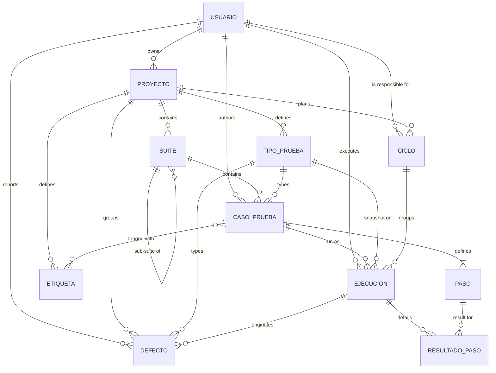
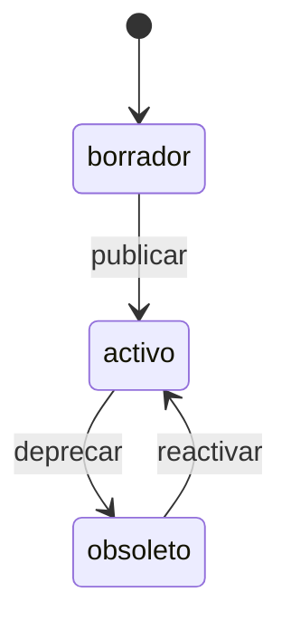
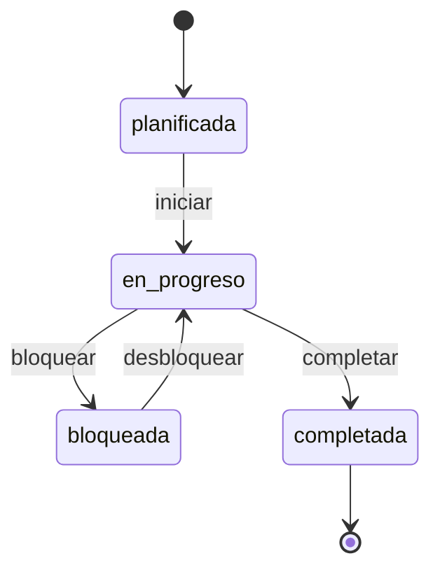
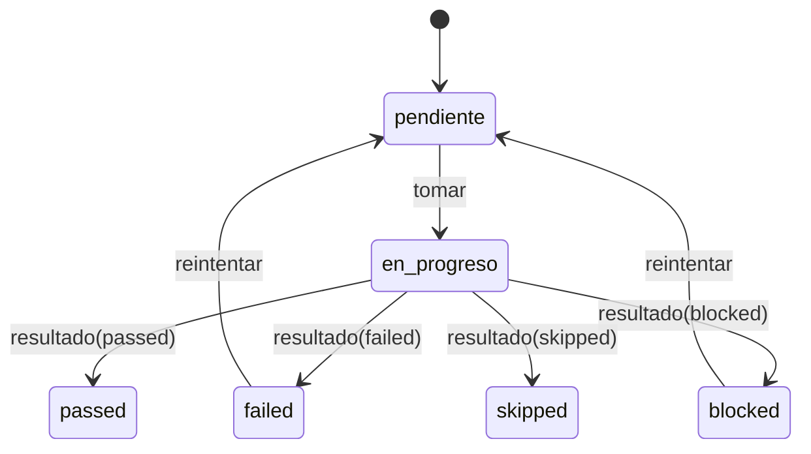
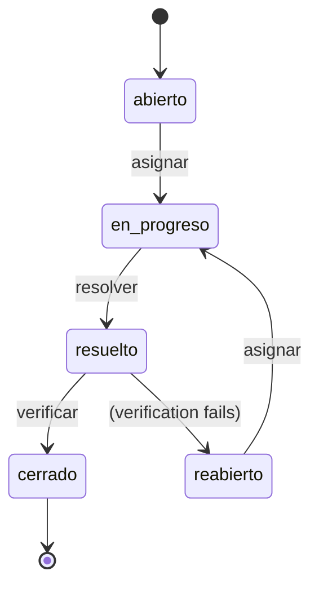

# Data Model

Reflects the actual SQLite schema (`server/src/db/schema.sql`). Field names below are the Spanish names used verbatim in the database, API payloads, and codebase (e.g. `titulo`, `estado`, `creadoEn`) — the tool's domain language is Spanish throughout the implementation even though this documentation is in English; no translation layer exists.

## 1. Entities

### 1.1 Usuario (User)

| Field | Type | Required | Description |
|---|---|---|---|
| `id` | UUID | yes | Primary key |
| `nombre` | string | yes | Display name |
| `email` | string | yes | Unique |
| `rol` | enum: `qa`, `gestor` | yes | Drives permissions and default views |
| `avatar_url` | string \| null | no | |
| `activo` | boolean | yes | Soft delete / deactivation |
| `creado_en` | datetime (ISO 8601, UTC) | yes | |

### 1.2 Proyecto (Project)

| Field | Type | Required | Description |
|---|---|---|---|
| `id` | UUID | yes | |
| `nombre` | string | yes | |
| `descripcion` | string \| null | no | |
| `propietario_id` | FK → Usuario | yes | |
| `estado` | enum: `activo`, `archivado` | yes | |
| `creado_en`, `actualizado_en` | datetime | yes | |

### 1.3 Etiqueta (Tag)

| Field | Type | Required | Description |
|---|---|---|---|
| `id` | UUID | yes | |
| `proyecto_id` | FK → Proyecto | yes | Tags are project-scoped |
| `nombre` | string | yes | Unique within a project |
| `color` | string (hex) | yes | |

### 1.4 Suite

Hierarchical grouping of test cases (a suite can have sub-suites via `suite_padre_id`).

| Field | Type | Required | Description |
|---|---|---|---|
| `id` | UUID | yes | |
| `proyecto_id` | FK → Proyecto | yes | |
| `suite_padre_id` | FK → Suite \| null | no | Folder hierarchy |
| `nombre` | string | yes | |
| `descripcion` | string \| null | no | |
| `creado_en`, `actualizado_en` | datetime | yes | |

### 1.5 Caso de prueba (Test case)

| Field | Type | Required | Description |
|---|---|---|---|
| `id` | UUID | yes | |
| `suite_id` | FK → Suite | yes | |
| `titulo` | string | yes | |
| `descripcion` | string \| null | no | |
| `precondiciones` | string \| null | no | |
| `prioridad` | enum: `alta`, `media`, `baja` | yes | |
| `tipo` | enum: `funcional`, `regresion`, `humo`, `exploratorio` | yes | **Legado/deprecado.** Se mantiene por compatibilidad hacia atrás (columna original, con su `CHECK` de 4 valores intacto) pero ya no es la fuente de verdad: úsese `tipo_prueba_id`. En un caso creado con un tipo fuera de esos 4 valores, `tipo` queda fijo en `'funcional'` como marcador de posición para satisfacer la restricción de la columna. |
| `tipo_prueba_id` | FK → [Tipo de prueba](#111-tipo-de-prueba-testing-type) \| null | no | Tipo de prueba real del caso. Si se omite al crear/editar, se resuelve automáticamente emparejando el slug de `tipo` con un tipo del mismo proyecto. |
| `estado` | enum: `borrador`, `activo`, `obsoleto` | yes | See [state machine](#31-test-case) |
| `autor_id` | FK → Usuario | yes | |
| `creado_en`, `actualizado_en` | datetime | yes | |
| tags | M:N via `caso_etiquetas` | no | |
| steps | 1:N `Paso`, min. 1 | yes | |

### 1.6 Paso (Step)

Embedded in a test case — no independent lifecycle.

| Field | Type | Required | Description |
|---|---|---|---|
| `id` | UUID | yes | |
| `caso_id` | FK → Caso de prueba | yes | |
| `orden` | integer | yes | Position, 1..n |
| `accion` | string | yes | What the executor does |
| `resultado_esperado` | string | yes | Acceptance criterion for the step |

### 1.7 Ciclo (Testing cycle / phase)

| Field | Type | Required | Description |
|---|---|---|---|
| `id` | UUID | yes | |
| `proyecto_id` | FK → Proyecto | yes | |
| `nombre` | string | yes | e.g. "Sprint 14 — Regression" |
| `descripcion` | string \| null | no | |
| `estado` | enum: `planificada`, `en_progreso`, `bloqueada`, `completada` | yes | See [state machine](#32-testing-cycle) |
| `fecha_inicio` | date (`YYYY-MM-DD`) | yes | |
| `fecha_fin_prevista` | date | yes | |
| `fecha_fin_real` | date \| null | no | Filled on completion |
| `responsable_id` | FK → Usuario | yes | Usually a `qa` user |
| `creado_en`, `actualizado_en` | datetime | yes | |

### 1.8 Ejecución (Execution)

An instance of a test case within a cycle — the unit that gets reported and exported.

| Field | Type | Required | Description |
|---|---|---|---|
| `id` | UUID | yes | |
| `ciclo_id` | FK → Ciclo | yes | |
| `caso_id` | FK → Caso de prueba | yes | |
| `ejecutor_id` | FK → Usuario \| null | no | Assigned when taken |
| `estado` | enum: `pendiente`, `en_progreso`, `passed`, `failed`, `blocked`, `skipped` | yes | See [state machine](#33-execution) |
| `tipo_prueba_id` | FK → [Tipo de prueba](#111-tipo-de-prueba-testing-type) \| null | no | **Foto fija** del `tipo_prueba_id` del caso en el momento de crear la ejecución (al asignar el caso a un ciclo). Si el caso se re-tipa después, esta ejecución conserva el tipo con el que realmente se ejecutó. |
| `fecha_ejecucion` | datetime \| null | no | Filled when closed |
| `duracion_segundos` | integer \| null | no | |
| `comentario` | string \| null | no | |
| `creado_en`, `actualizado_en` | datetime | yes | |
| step results | 1:N `ResultadoPaso` | no | |
| defects | 1:N `Defecto` (via `ejecucion_origen_id`) | no | |

### 1.9 Resultado de paso (Step result)

| Field | Type | Required | Description |
|---|---|---|---|
| `id` | UUID | yes | |
| `ejecucion_id` | FK → Ejecución | yes | |
| `paso_id` | FK → Paso | yes | |
| `estado` | enum: `pass`, `fail`, `skip` | yes | |
| `comentario` | string \| null | no | |

### 1.10 Defecto (Defect)

| Field | Type | Required | Description |
|---|---|---|---|
| `id` | UUID | yes | |
| `proyecto_id` | FK → Proyecto | yes | |
| `ejecucion_origen_id` | FK → Ejecución \| null | no | Execution that detected it, if any |
| `tipo_prueba_id` | FK → [Tipo de prueba](#111-tipo-de-prueba-testing-type) \| null | no | Heredado automáticamente de `ejecucion_origen_id.tipo_prueba_id` cuando el defecto se reporta desde una ejecución (`POST /ejecuciones/:id/defectos`, sin entrada manual posible). Obligatorio y seleccionable cuando se reporta sin ejecución de origen (`POST /proyectos/:id/defectos`). `null` solo en defectos reportados sin este campo antes de existir (no se inventa un valor retroactivo). |
| `titulo` | string | yes | |
| `descripcion` | string \| null | no | |
| `severidad` | enum: `critica`, `alta`, `media`, `baja` | yes | |
| `estado` | enum: `abierto`, `en_progreso`, `resuelto`, `cerrado`, `reabierto` | yes | See [state machine](#34-defect) |
| `reportado_por_id` | FK → Usuario | yes | |
| `creado_en`, `actualizado_en` | datetime | yes | |

### 1.11 Tipo de prueba (Testing type)

Dimensión gestionada y filtrable del tipo de testing (funcional, regresión, humo, exploratorio, integración, rendimiento, usabilidad, accesibilidad) — sustituye al antiguo campo suelto `Caso.tipo` como fuente de verdad, sin eliminarlo (ver nota de compatibilidad en [1.5](#15-caso-de-prueba-test-case)).

| Field | Type | Required | Description |
|---|---|---|---|
| `id` | UUID | yes | |
| `proyecto_id` | FK → Proyecto | yes | Cada proyecto tiene su propio set de tipos, igual que `Etiqueta` |
| `nombre` | string | yes | |
| `slug` | string | yes | Derivado de `nombre`; único por proyecto |
| `color` | string (hex) | yes | |
| `archivado` | boolean | yes | Un tipo archivado deja de poder asignarse a casos nuevos, pero los registros históricos que ya lo usaban lo conservan |
| `creado_en` | datetime | yes | |

Cada proyecto se siembra automáticamente, al crearse, con 8 tipos por defecto: `funcional`, `regresion`, `humo`, `exploratorio`, `integracion`, `rendimiento`, `usabilidad`, `accesibilidad` (los 4 primeros con el mismo slug que los valores históricos de `Caso.tipo`, para que el backfill de una base existente pueda emparejarlos exactamente).

## 2. Entity relationship diagram

## 3. State machines

### 3.1 Test case

| Transition | Effect |
|---|---|
| `borrador → activo` (`publicar`) | Case becomes assignable to cycles |
| `activo → obsoleto` (`deprecar`) | Case can no longer be added to new cycles; historical executions are preserved |
| `obsoleto → activo` (`reactivar`) | Manual reactivation |

An `obsoleto` case **cannot** be included in a new execution (validated in `POST /api/ciclos/:id/casos`).

### 3.2 Testing cycle

`completada` has no outgoing transition — to run the same cases again, a new cycle is created. `bloquear` requires a `comentario` explaining why.

### 3.3 Execution

`passed` and `skipped` are terminal within the current cycle (no retry) — to test again, a new execution is generated in a later cycle. `failed` commonly leads to filing a `Defecto`.

### 3.4 Defect

## 4. Integrity rules enforced by the API

1. A Suite with `activo` test cases attached cannot be deleted (`422`).
2. A test case with historical executions cannot be deleted (`422`) — use `deprecar` instead.
3. `Ejecucion.caso_id` must reference a case whose `estado != obsoleto` at creation time.
4. `resultadosPaso` submitted when closing an Execution must cover the same set of `pasoId`s as `Caso.pasos` at the time the execution was created.
5. A Defect with a non-null `ejecucion_origen_id` inherits its `proyecto_id` transitively (execution → case → suite → project).
6. `Caso.tipo_prueba_id` / `Defecto.tipo_prueba_id`, when provided, must reference a `TipoPrueba` belonging to the same project (`400` otherwise).
7. A Defect with a non-null `ejecucion_origen_id` always inherits `tipo_prueba_id` from that execution — it cannot be set manually on that request. A Defect with `ejecucion_origen_id = null` (standalone) requires `tipo_prueba_id` in the request body (`400` if missing).
8. `Ejecucion.tipo_prueba_id` is fixed at creation time from `Caso.tipo_prueba_id` and never changes afterward, even if the case is later re-typed (see [1.8](#18-ejecución-execution)).

## 5. Derived fields (computed by the API, not persisted)

| Field | Computed as | Used in |
|---|---|---|
| `ciclo.totalCasos` | count of executions in the cycle | Dashboard, cycle view |
| `ciclo.tasaAvance` | `(passed+failed+blocked+skipped) / total` | Dashboard |
| `ciclo.tasaExito` | `passed / (passed+failed)` | Dashboard, export |
| `suite.cobertura` | active cases with an execution in the current cycle / total active cases | Suite listing |
| `defecto.casoAsociado` | via `ejecucion_origen_id → Ejecucion.caso_id` | Defect detail |
| `ejecucion.casoTitulo` | `Ejecucion.caso_id → CasoPrueba.titulo` | Export (JSON, Markdown, Notion) |
| `ejecucion.suiteNombre` | `caso_id → suite_id → Suite.nombre` | Export; desnormalized into the `ejecucion_cerrada` log event |
| `ejecucion.ejecutor` | `ejecutor_id → Usuario.nombre` | Export (readable name, not the raw id) |
| cycle summary counts | count of executions grouped by `estado` | Export §1 |
| `exportadoEn` / `exportadoPor` | timestamp / requesting user's name at export time | Export §1 |
