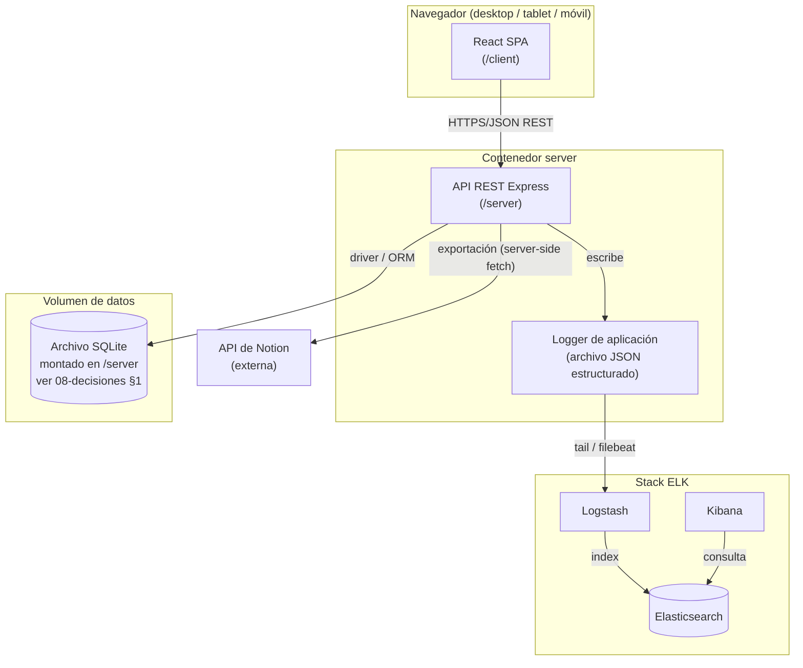
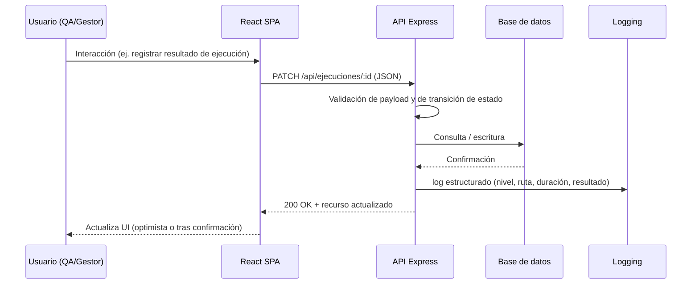
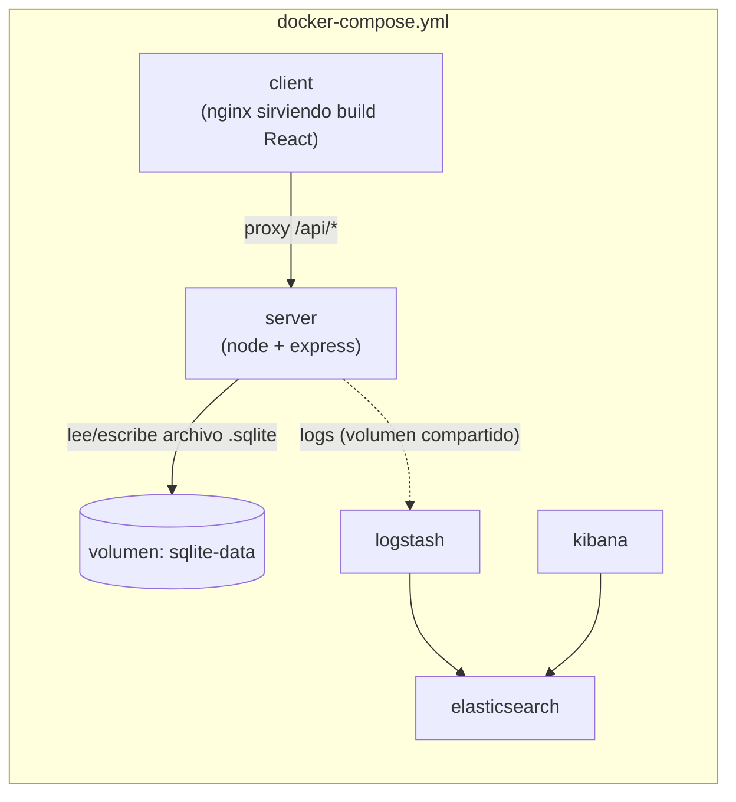
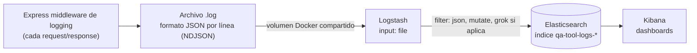
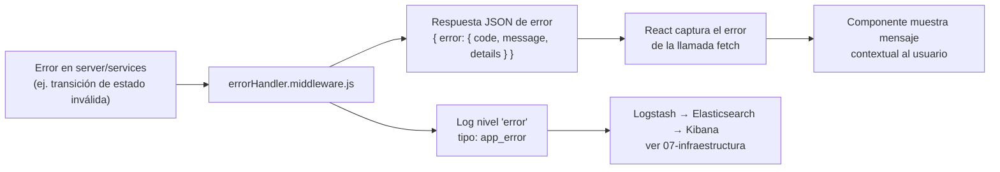
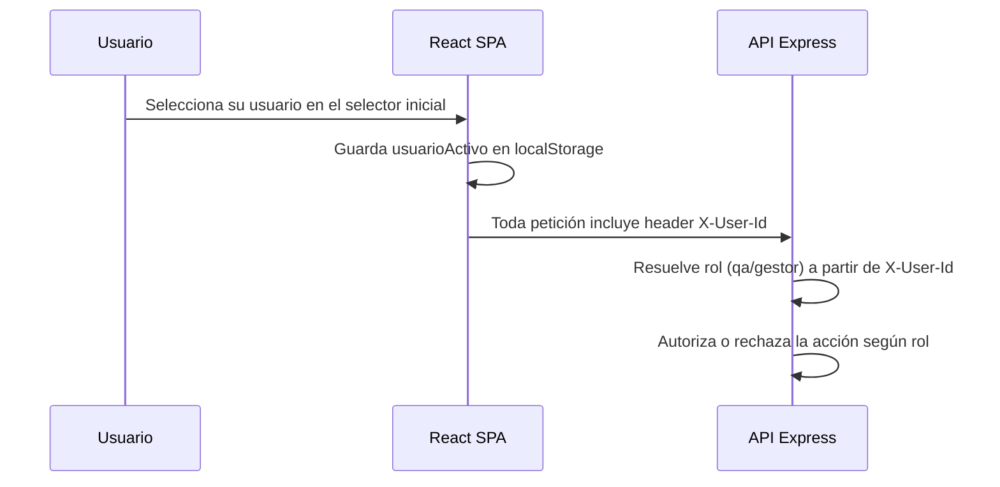

# 01 — Arquitectura

## 1. Visión general

Aplicación local de gestión de casos de prueba, mono-repo con dos aplicaciones (`/client`, `/server`) orquestadas por Docker Compose, más un stack de observabilidad ELK. No es SaaS: se ejecuta en la máquina o red local del equipo de QA.

Stack fijado (no negociable):

- Frontend: React (`.jsx`)
- Backend: Node.js + Express (`.js`)
- Contenerización: Docker + docker-compose
- Observabilidad: Elasticsearch, Logstash, Kibana

## 2. Diagrama de componentes



## 3. Flujo de datos frontend ↔ API ↔ BD



Principios:

- El frontend no accede a la base de datos ni al stack ELK directamente; todo pasa por la API REST.
- Las validaciones de negocio (transiciones de estado de [[02-modelo-datos]]) viven en el servidor, no solo en el cliente.
- Toda petición HTTP a la API genera una entrada de log estructurada (ver sección 5 y [[07-infraestructura]]).

## 4. Contenedores y orquestación



Cada servicio de aplicación corre en su propio contenedor; la persistencia de datos de negocio no requiere un contenedor propio porque el motor elegido es SQLite ([[08-decisiones]] §1), un archivo montado en un volumen Docker accedido directamente por `server`. Si en el futuro se migra a PostgreSQL (alternativa de reserva en [[08-decisiones]] §1), este diagrama pasaría a incluir un contenedor `db` equivalente al que sustituye al volumen `sqlite-data`.

El detalle de puertos y variables de entorno se define en [[07-infraestructura]] (este documento no incluye `docker-compose.yml`, solo el rol de cada servicio).

Comunicación entre contenedores: red interna de Docker Compose (bridge por defecto). Solo `client` expone puerto al host para el navegador; `kibana` expone puerto para consulta de observabilidad. `elasticsearch` y `logstash` no necesitan exponerse al host salvo para depuración local. `server` no expone puerto al host directamente: todo el tráfico del navegador entra por `client`, que actúa como proxy inverso de `/api/*` hacia `server` (decisión detallada en [[08-decisiones]] §13).

## 5. Flujo de logs hacia ELK



Detalle en [[07-infraestructura]]: formato exacto de cada línea de log, pipeline de Logstash e índices resultantes.

## 6. Estructura de carpetas propuesta

### `/client`

```
client/
├── public/
│   └── index.html
├── src/
│   ├── api/                 # funciones fetch hacia la API (una por recurso)
│   │   ├── casosApi.jsx
│   │   ├── ciclosApi.jsx
│   │   ├── ejecucionesApi.jsx
│   │   ├── defectosApi.jsx
│   │   └── exportApi.jsx
│   ├── components/          # componentes reutilizables (botón, badge de estado, tabla)
│   │   ├── EstadoBadge.jsx
│   │   ├── NavBar.jsx
│   │   └── ...
│   ├── screens/             # una carpeta por pantalla (ver 04-ui-ux)
│   │   ├── Dashboard/
│   │   ├── CasosPrueba/
│   │   ├── EjecucionCiclo/
│   │   ├── FasesTesting/
│   │   └── Resultados/
│   ├── context/             # contexto de usuario/rol (QA vs gestor)
│   │   └── UsuarioContext.jsx
│   ├── hooks/                # hooks de datos (useCasos, useCiclo, etc.)
│   ├── styles/               # tokens de diseño, ver 05-responsive-y-design-system
│   ├── App.jsx
│   └── index.jsx
└── package.json
```

### `/server`

```
server/
├── src/
│   ├── routes/               # un router por recurso, agrupados como en 03-api-contract
│   │   ├── proyectos.routes.js
│   │   ├── suites.routes.js
│   │   ├── casos.routes.js
│   │   ├── ciclos.routes.js
│   │   ├── ejecuciones.routes.js
│   │   ├── defectos.routes.js
│   │   ├── usuarios.routes.js
│   │   └── export.routes.js
│   ├── controllers/          # lógica de cada endpoint
│   ├── services/             # reglas de negocio (transiciones de estado, cálculo de métricas)
│   ├── models/                # definición de entidades sobre el motor de BD elegido
│   ├── middleware/
│   │   ├── logger.middleware.js   # genera el log estructurado por request
│   │   ├── errorHandler.middleware.js
│   │   └── validate.middleware.js
│   ├── integrations/
│   │   └── notion.client.js  # cliente hacia la API de Notion
│   ├── app.js
│   └── server.js
└── package.json
```

Esta estructura es indicativa (no se generan estos archivos en esta iteración; sirve como referencia para la fase de implementación).

## 7. Responsabilidades por capa

| Capa | Responsabilidad | No responsabilidad |
|---|---|---|
| `client` | Renderizado, navegación, formularios, feedback visual por rol | Validación de negocio definitiva, acceso a BD |
| `server/routes` + `controllers` | Recibir petición HTTP, delegar a `services`, dar forma a la respuesta | Contener reglas de negocio complejas |
| `server/services` | Validar transiciones de estado ([[02-modelo-datos]] sección 3), calcular campos derivados, orquestar exportación | Detalles HTTP |
| `server/models` | Acceso a datos | Lógica de negocio |
| ELK | Observabilidad de la app (logs, métricas de uso de API) | Almacenar datos de negocio (casos, ejecuciones) |

## 8. Manejo de errores end-to-end



Principio: ningún error de negocio (`409`, `422`) debe llegar al usuario como una pantalla en blanco o un mensaje genérico de "algo salió mal"; el cuerpo de error estándar de [[03-api-contract]] siempre trae `code` y `message` legibles, que el cliente mapea a un mensaje contextual por pantalla.

## 9. Autenticación mínima entre `client` y `server`

Dado que la autenticación completa está fuera de alcance ([[08-decisiones]] §2), el flujo mínimo es:



Este flujo no sustituye una autenticación real; documenta únicamente cómo el sistema atribuye autoría y aplica permisos por rol dentro de la confianza asumida de una red local (ver riesgo en [[08-decisiones]] §2).

## 10. Variables de configuración por servicio (referencia)

No se generan archivos `.env` en esta iteración; esta tabla documenta qué necesitará configurarse cuando se implemente, para que la arquitectura no dependa de valores fijos en el código:

| Servicio | Variable (referencia) | Propósito |
|---|---|---|
| `server` | `SQLITE_DB_PATH` | Ruta del archivo SQLite dentro del volumen |
| `server` | `LOG_FILE_PATH` | Ruta del archivo NDJSON de logs |
| `server` | `NOTION_API_BASE_URL` | Base URL de la API de Notion usada por `integrations/notion.client.js` |
| `client` (build) | `API_PROXY_TARGET` | Host interno del contenedor `server` para el proxy de nginx |
| `logstash` | `ES_HOST` | Host del contenedor `elasticsearch` |
| `kibana` | `ELASTICSEARCH_HOSTS` | Host del contenedor `elasticsearch` |

## 11. Decisiones de arquitectura abiertas

Remitidas a [[08-decisiones]]: elección del motor de base de datos (§1), capa de acceso a datos (§9), formato exacto de autenticación/roles (§2, fuera de alcance salvo lo mínimo para distinguir QA/gestor), estrategia de contenedor `client` (§3, servido por nginx vs. servidor de desarrollo), librería de logging (§12), y comunicación entre `client` y `server` (§13).
