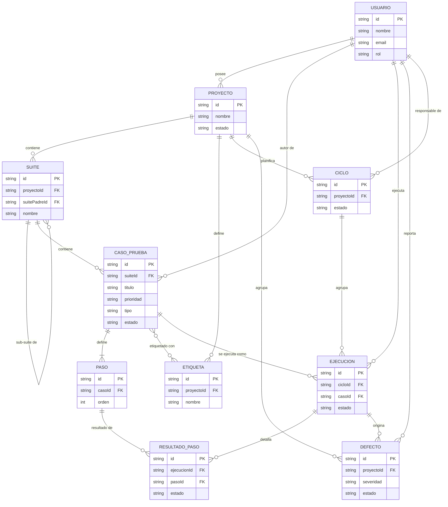
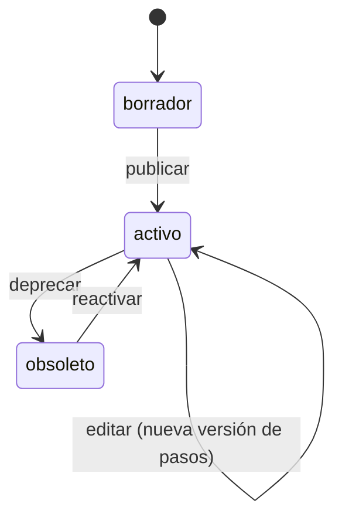
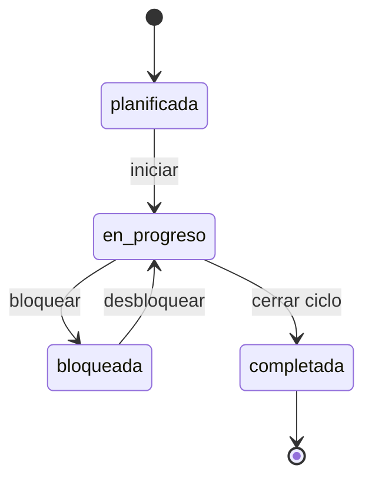
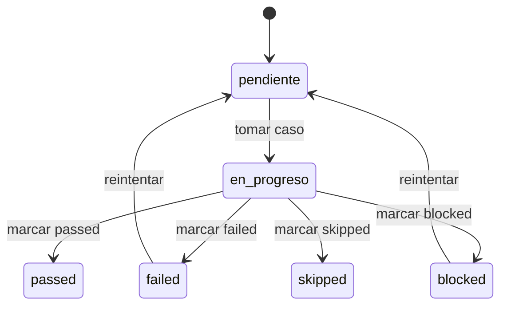
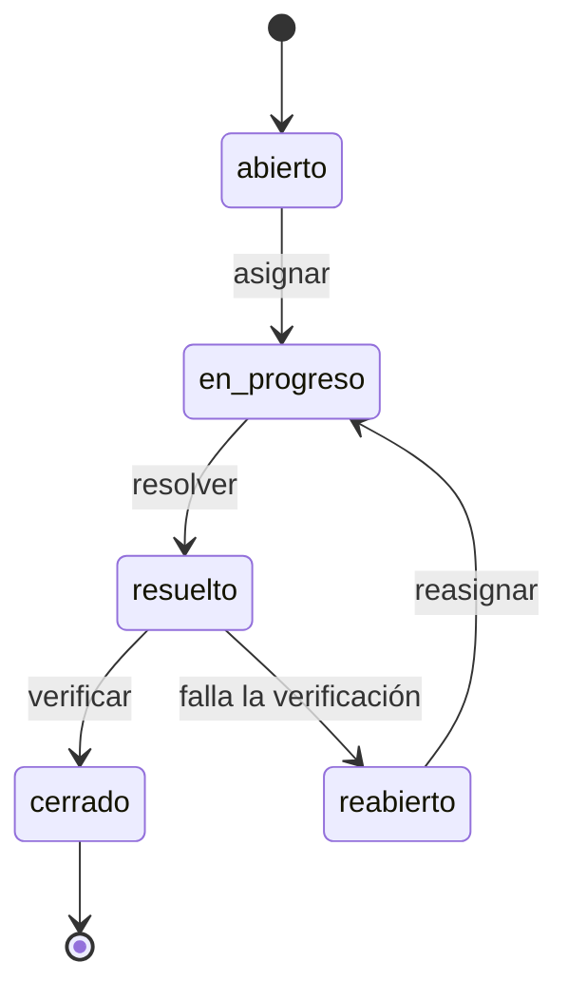

# 02 — Modelo de datos

## Propósito

Este documento define las entidades, relaciones, campos y máquinas de estado que sirven de base común para `03-api-contract.md`, `04-ui-ux.md` y `06-exportacion.md`. Todo campo que aparezca en el contrato de API o en el esquema de exportación debe estar declarado aquí.

## 1. Entidades

### 1.1 Usuario

| Campo | Tipo | Obligatorio | Descripción |
|---|---|---|---|
| `id` | string (UUID) | sí | Identificador único |
| `nombre` | string | sí | Nombre visible |
| `email` | string | sí | Identificador de login, único |
| `rol` | enum: `qa`, `gestor` | sí | Determina permisos y vistas por defecto ([[04-ui-ux]]) |
| `avatarUrl` | string \| null | no | URL o ruta local a avatar |
| `activo` | boolean | sí | Baja lógica |
| `creadoEn` | datetime (ISO 8601) | sí | Alta del usuario |

### 1.2 Proyecto

| Campo | Tipo | Obligatorio | Descripción |
|---|---|---|---|
| `id` | string (UUID) | sí | Identificador único |
| `nombre` | string | sí | Nombre del proyecto |
| `descripcion` | string | no | Texto libre |
| `propietarioId` | string (FK Usuario) | sí | Responsable del proyecto |
| `estado` | enum: `activo`, `archivado` | sí | Ciclo de vida del proyecto |
| `creadoEn` | datetime | sí | |
| `actualizadoEn` | datetime | sí | |

### 1.3 Etiqueta

| Campo | Tipo | Obligatorio | Descripción |
|---|---|---|---|
| `id` | string (UUID) | sí | |
| `proyectoId` | string (FK Proyecto) | sí | Las etiquetas son propias de un proyecto |
| `nombre` | string | sí | Único dentro del proyecto |
| `color` | string (hex) | sí | Ver [[05-responsive-y-design-system]] para paleta |

### 1.4 Suite

Agrupación jerárquica de casos de prueba (una suite puede tener sub-suites vía `suitePadreId`).

| Campo | Tipo | Obligatorio | Descripción |
|---|---|---|---|
| `id` | string (UUID) | sí | |
| `proyectoId` | string (FK Proyecto) | sí | |
| `suitePadreId` | string (FK Suite) \| null | no | Jerarquía de carpetas |
| `nombre` | string | sí | |
| `descripcion` | string | no | |
| `creadoEn` | datetime | sí | |
| `actualizadoEn` | datetime | sí | |

### 1.5 Caso de prueba

| Campo | Tipo | Obligatorio | Descripción |
|---|---|---|---|
| `id` | string (UUID) | sí | |
| `suiteId` | string (FK Suite) | sí | |
| `titulo` | string | sí | |
| `descripcion` | string | no | Objetivo del caso |
| `precondiciones` | string | no | |
| `prioridad` | enum: `alta`, `media`, `baja` | sí | |
| `tipo` | enum: `funcional`, `regresion`, `humo`, `exploratorio` | sí | |
| `estado` | enum: `borrador`, `activo`, `obsoleto` | sí | Ver máquina de estados 3.1 |
| `etiquetaIds` | string[] (FK Etiqueta) | no | |
| `autorId` | string (FK Usuario) | sí | |
| `creadoEn` | datetime | sí | |
| `actualizadoEn` | datetime | sí | |
| `pasos` | Paso[] | sí (mín. 1) | Ordenados, ver 1.6 |

### 1.6 Paso

Los pasos viven embebidos en el caso de prueba (no tienen ciclo de vida propio fuera de él).

| Campo | Tipo | Obligatorio | Descripción |
|---|---|---|---|
| `id` | string (UUID) | sí | |
| `casoId` | string (FK Caso de prueba) | sí | |
| `orden` | integer | sí | Posición 1..n |
| `accion` | string | sí | Qué hace el ejecutor |
| `resultadoEsperado` | string | sí | Criterio de aceptación del paso |

### 1.7 Fase / Ciclo de testing

| Campo | Tipo | Obligatorio | Descripción |
|---|---|---|---|
| `id` | string (UUID) | sí | |
| `proyectoId` | string (FK Proyecto) | sí | |
| `nombre` | string | sí | p. ej. "Sprint 14 — Regresión" |
| `descripcion` | string | no | |
| `estado` | enum: `planificada`, `en_progreso`, `bloqueada`, `completada` | sí | Ver máquina de estados 3.2 |
| `fechaInicio` | date | sí | |
| `fechaFinPrevista` | date | sí | |
| `fechaFinReal` | date \| null | no | Se rellena al completar |
| `responsableId` | string (FK Usuario) | sí | Normalmente rol `qa` |
| `creadoEn` | datetime | sí | |
| `actualizadoEn` | datetime | sí | |

### 1.8 Ejecución

Instancia de un caso de prueba dentro de una fase/ciclo. Es la unidad que se reporta y exporta.

| Campo | Tipo | Obligatorio | Descripción |
|---|---|---|---|
| `id` | string (UUID) | sí | |
| `cicloId` | string (FK Fase/Ciclo) | sí | |
| `casoId` | string (FK Caso de prueba) | sí | |
| `ejecutorId` | string (FK Usuario) \| null | no | Se asigna al tomar el caso |
| `estado` | enum: `pendiente`, `en_progreso`, `passed`, `failed`, `blocked`, `skipped` | sí | Ver máquina de estados 3.3 |
| `fechaEjecucion` | datetime \| null | no | Se rellena al cerrar el estado |
| `duracionSegundos` | integer \| null | no | |
| `comentario` | string | no | |
| `resultadosPaso` | ResultadoPaso[] | no | Detalle por paso, ver 1.9 |
| `defectoIds` | string[] (FK Defecto) | no | Defectos abiertos desde esta ejecución |
| `creadoEn` | datetime | sí | |
| `actualizadoEn` | datetime | sí | |

### 1.9 Resultado de paso

| Campo | Tipo | Obligatorio | Descripción |
|---|---|---|---|
| `id` | string (UUID) | sí | |
| `ejecucionId` | string (FK Ejecución) | sí | |
| `pasoId` | string (FK Paso) | sí | |
| `estado` | enum: `pass`, `fail`, `skip` | sí | |
| `comentario` | string | no | |

### 1.10 Defecto

| Campo | Tipo | Obligatorio | Descripción |
|---|---|---|---|
| `id` | string (UUID) | sí | |
| `proyectoId` | string (FK Proyecto) | sí | |
| `ejecucionOrigenId` | string (FK Ejecución) \| null | no | Ejecución que lo detectó, si aplica |
| `titulo` | string | sí | |
| `descripcion` | string | no | |
| `severidad` | enum: `critica`, `alta`, `media`, `baja` | sí | |
| `estado` | enum: `abierto`, `en_progreso`, `resuelto`, `cerrado`, `reabierto` | sí | Ver máquina de estados 3.4 |
| `reportadoPorId` | string (FK Usuario) | sí | |
| `creadoEn` | datetime | sí | |
| `actualizadoEn` | datetime | sí | |

## 2. Diagrama entidad-relación

## 3. Máquinas de estado

### 3.1 Caso de prueba

| Transición | Quién puede | Efecto |
|---|---|---|
| `borrador → activo` | QA | El caso queda disponible para asignarse a ciclos |
| `activo → obsoleto` | QA | El caso no puede añadirse a nuevos ciclos; ejecuciones históricas se conservan |
| `obsoleto → activo` | QA | Reactivación manual |

Un caso `obsoleto` **no puede** ser incluido en una ejecución nueva (regla validada en `POST /ciclos/:id/ejecuciones`, ver [[03-api-contract]]).

### 3.2 Fase / Ciclo de testing

| Transición | Condición |
|---|---|
| `planificada → en_progreso` | Manual, requiere al menos 1 ejecución generada |
| `en_progreso → bloqueada` | Manual (p. ej. entorno caído); requiere motivo en `comentario` |
| `en_progreso → completada` | Manual; se permite con ejecuciones en `pendiente` pero la UI advierte (ver [[04-ui-ux]] pantalla "Vista de fases") |
| `completada → *` | No hay transición de salida; para reabrir se crea un nuevo ciclo |

### 3.3 Ejecución

`passed` y `skipped` son estados terminales dentro del ciclo actual (no tienen reintento; para volver a probar se genera una nueva ejecución en un ciclo posterior). `failed` normalmente da lugar a la creación de un Defecto (`defectoIds`).

### 3.4 Defecto

## 4. Reglas de integridad relevantes para la API

1. No se puede eliminar una Suite con Casos de prueba activos asociados (soft-delete o bloqueo, decidir en [[08-decisiones]]).
2. No se puede eliminar un Caso de prueba con Ejecuciones históricas; se marca `obsoleto`.
3. `Ejecucion.casoId` debe apuntar a un caso con `estado != obsoleto` en el momento de la creación.
4. `resultadosPaso` de una Ejecución debe cubrir el mismo conjunto de `pasoId` que `Caso.pasos` en el momento de creación de la ejecución (snapshot implícito).
5. Un Defecto con `ejecucionOrigenId` no nulo hereda `proyectoId` de esa ejecución (a través de `caso → suite → proyecto`).

## 5. Campos derivados (no persistidos, calculados en API)

Estos campos aparecen en respuestas de API ([[03-api-contract]]) y en exportación ([[06-exportacion]]) pero no se guardan en BD:

| Campo derivado | Origen | Uso |
|---|---|---|
| `ciclo.totalCasos` | `count(Ejecucion where cicloId)` | Dashboard, vista de fases |
| `ciclo.tasaAvance` | `(passed+failed+blocked+skipped)/total` | Dashboard |
| `ciclo.tasaExito` | `passed/(passed+failed)` | Dashboard, exportación |
| `suite.cobertura` | `casos activos con ejecución en ciclo actual / casos activos totales` | Listado de suites |
| `defecto.casoAsociado` | vía `ejecucionOrigenId → Ejecucion.casoId` | Detalle de defecto |
| `ejecucion.casoTitulo` | `Ejecucion.casoId → CasoPrueba.titulo` | Exportación (JSON §1, Markdown §2, Notion §3) |
| `ejecucion.suiteNombre` | `Ejecucion.casoId → CasoPrueba.suiteId → Suite.nombre` | Exportación; también desnormalizado en el log `ejecucion_cerrada` ([[07-infraestructura]] §5) |
| `ejecucion.ejecutor` | `Ejecucion.ejecutorId → Usuario.nombre` | Exportación (nombre legible, no el `id`) |
| `resumen.totalCasos` / `passed` / `failed` / `blocked` / `skipped` / `pendiente` | `count(Ejecucion where cicloId)` agrupado por `estado` | Exportación §1 (resumen del ciclo) |
| `exportadoEn` | `now()` en el momento de generar la exportación | Exportación §1 |
| `exportadoPor` | `Usuario.nombre` del usuario que solicita la exportación (vía `X-User-Id`, [[08-decisiones]] §2) | Exportación §1 |
