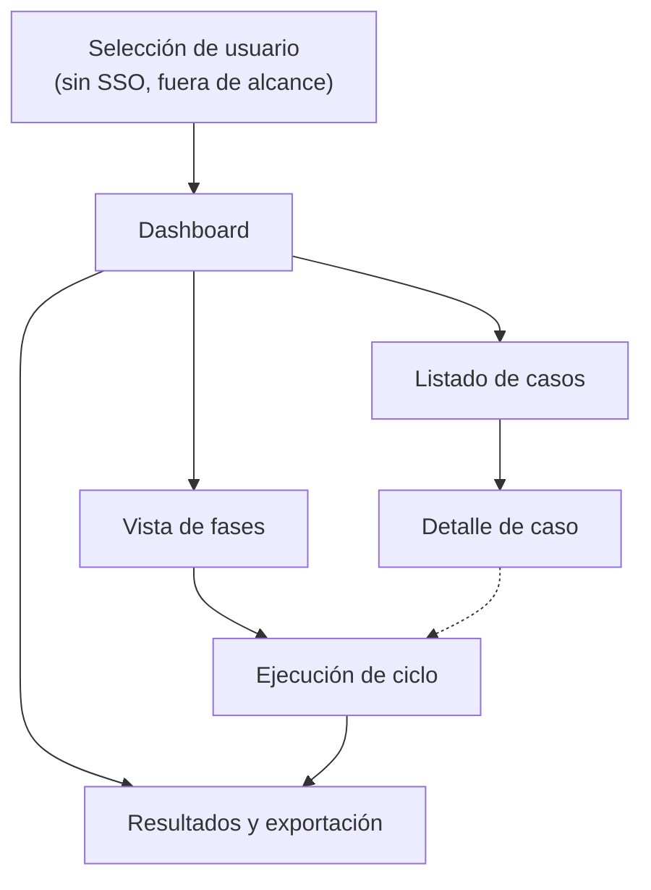

# 04 — Diseño UI/UX

## 1. Perfiles

| Perfil | Objetivo principal | Acciones frecuentes |
|---|---|---|
| **QA** | Crear, mantener y ejecutar casos de prueba | Escribir casos, planificar ciclos, ejecutar, reportar defectos |
| **Gestor** | Supervisar estado, cobertura y bloqueos | Consultar dashboards, exportar resultados, ver defectos abiertos |

El rol (`Usuario.rol`, [[02-modelo-datos]]) determina qué acciones se muestran habilitadas en cada pantalla. El gestor tiene acceso de solo lectura salvo en exportación.

## 2. Inventario de pantallas

| # | Pantalla | Ruta (cliente) |
|---|---|---|
| 1 | Dashboard | `/` |
| 2 | Listado de casos de prueba | `/proyectos/:id/casos` |
| 3 | Detalle de caso de prueba | `/casos/:id` |
| 4 | Ejecución de un ciclo de pruebas | `/ciclos/:id/ejecutar` |
| 5 | Vista de fases y pendientes | `/proyectos/:id/fases` |
| 6 | Resultados y exportación | `/ciclos/:id/resultados` |

## 3. Jerarquía de navegación



Navegación persistente (desktop: barra lateral; móvil: barra inferior, ver [[05-responsive-y-design-system]]): Dashboard, Casos, Fases, Resultados.

## 4. Pantalla 1 — Dashboard

### Wireframe (desktop)

```
┌─────────────────────────────────────────────────────────┐
│ [Logo]  Dashboard   Casos   Fases   Resultados    [Ana ▾]│
├─────────────────────────────────────────────────────────┤
│  Proyecto: [App Móvil Banca ▾]                           │
│                                                            │
│  ┌───────────┐ ┌───────────┐ ┌───────────┐ ┌───────────┐ │
│  │ Ciclos     │ │ Casos      │ │ Tasa éxito│ │ Defectos  │ │
│  │ activos: 2 │ │ activos:84 │ │  76%      │ │ abiertos:5│ │
│  └───────────┘ └───────────┘ └───────────┘ └───────────┘ │
│                                                            │
│  Avance del ciclo actual: "Sprint 14 — Regresión"          │
│  [██████████████░░░░░░░░] 62%  (passed 40 / failed 6 /    │
│                                  blocked 2 / pendiente 20) │
│                                                            │
│  Últimos defectos                    Ciclos recientes      │
│  ┌─────────────────────────┐  ┌─────────────────────────┐│
│  │ #241 Login no redirige   │  │ Sprint 13 — completada   ││
│  │  alta · abierto          │  │  Sprint 14 — en progreso ││
│  └─────────────────────────┘  └─────────────────────────┘│
└─────────────────────────────────────────────────────────┘
```

| Perfil | Qué ve |
|---|---|
| **QA** | Igual que arriba, con acceso rápido a "Continuar ejecutando" (deep-link a su ejecución `en_progreso`) |
| **Gestor** | Mismos KPIs; tarjetas adicionales de cobertura por suite; sin acción "continuar ejecución"; botón "Exportar" visible en la tarjeta de ciclo actual |

## 5. Pantalla 2/3 — Listado y detalle de casos de prueba

### Wireframe listado (desktop)

```
┌─────────────────────────────────────────────────────────┐
│ Casos de prueba — App Móvil Banca         [+ Nuevo caso] │
├─────────────────────────────────────────────────────────┤
│ Filtros: [Suite ▾] [Prioridad ▾] [Tipo ▾] [Estado ▾] [🔍]│
├─────────────────────────────────────────────────────────┤
│ ☐ │ Título                  │ Suite      │ Prio │ Estado │
│───┼─────────────────────────┼────────────┼──────┼────────│
│ ☐ │ Login credenciales OK   │ Auth       │ alta │ activo │
│ ☐ │ Login credenciales KO   │ Auth       │ media│ activo │
│ ☐ │ Recuperar contraseña    │ Auth       │ baja │ borrador│
├─────────────────────────────────────────────────────────┤
│ [Añadir a ciclo ▾]                     ‹ 1 2 3 ... 7 › │
└─────────────────────────────────────────────────────────┘
```

### Wireframe detalle (desktop)

```
┌─────────────────────────────────────────────────────────┐
│ ← Casos   Login credenciales válidas        [Editar] [⋮] │
├─────────────────────────────────────────────────────────┤
│ Estado: ACTIVO   Prioridad: ALTA   Tipo: Funcional         │
│ Suite: Auth > Login     Etiquetas: [smoke] [critico]       │
│                                                            │
│ Precondiciones: Usuario registrado y activo                │
│                                                            │
│ Pasos                                                       │
│ 1. Introducir email y contraseña válidos                    │
│    → Los campos aceptan la entrada                          │
│ 2. Pulsar "Entrar"                                           │
│    → Se redirige al dashboard                                │
│                                                            │
│ Historial de ejecuciones (5)                                │
│ Sprint 14 · passed · Ana · 21/08  |  Sprint 13 · passed ...  │
└─────────────────────────────────────────────────────────┘
```

| Perfil | Qué ve |
|---|---|
| **QA** | CRUD completo, botones publicar/deprecar/reactivar, checkbox de selección múltiple + "Añadir a ciclo" |
| **Gestor** | Vista de solo lectura (sin `[+ Nuevo caso]`, sin `[Editar]`); historial de ejecuciones visible; puede filtrar y exportar el listado visible |

## 6. Pantalla 4 — Ejecución de un ciclo de pruebas

Pantalla exclusiva del perfil QA (el gestor no ejecuta casos).

### Wireframe (desktop)

```
┌─────────────────────────────────────────────────────────┐
│ Sprint 14 — Regresión         18/40 ejecutados   [Salir] │
├───────────────┬───────────────────────────────────────┤
│ Cola de casos  │ Login credenciales válidas             │
│ ☐ Login OK  ▶  │ Suite: Auth > Login    Prioridad: alta │
│ ☐ Login KO     │                                         │
│ ☐ Recuperar... │ Pasos                                    │
│ ☐ Sesión exp.  │ 1. Introducir email y contraseña válidas │
│                │    → Se redirige al dashboard             │
│                │    Resultado: [pass][fail][blocked][skip]│
│                │                                             │
│                │ 2. Pulsar "Entrar"                          │
│                │    Resultado: [pass][fail][blocked][skip]  │
│                │                                             │
│                │ Comentario general: [______________]        │
│                │ [Reportar defecto]     [Guardar resultado]  │
└───────────────┴───────────────────────────────────────┘
```

### Wireframe (móvil, 375px)

```
┌──────────────────────┐
│ ← Sprint 14   18/40   │
├──────────────────────┤
│ Login credenciales OK │
│ Auth > Login · alta   │
├──────────────────────┤
│ Paso 1/2               │
│ Introducir email y     │
│ contraseña válidas     │
│ → Se redirige al       │
│   dashboard             │
│                         │
│ [ pass ] [ fail ]        │
│ [blocked] [ skip ]        │
├──────────────────────┤
│ [Reportar defecto]        │
│ [Guardar y siguiente]      │
└──────────────────────┘
```

| Perfil | Qué ve |
|---|---|
| **QA** | Cola de casos pendientes/en progreso, formulario de ejecución paso a paso, acceso directo a "Reportar defecto" tras un `fail` |
| **Gestor** | Sin acceso a esta pantalla (redirigido a Vista de fases si intenta entrar por URL) |

## 7. Pantalla 5 — Vista de fases y pendientes

### Wireframe (desktop)

```
┌─────────────────────────────────────────────────────────┐
│ Fases — App Móvil Banca                    [+ Nueva fase]│
├─────────────────────────────────────────────────────────┤
│ Sprint 14 — Regresión              EN PROGRESO             │
│ [██████████████░░░░░░░░] 62%   Fin previsto: 28/08/2026   │
│ passed 40 · failed 6 · blocked 2 · pendiente 20             │
│ [Ir a ejecutar] [Bloquear] [Completar]                       │
│───────────────────────────────────────────────────────────│
│ Sprint 13 — Smoke                  COMPLETADA               │
│ [████████████████████████] 100%  Fin real: 10/08/2026      │
│ passed 22 · failed 1 · blocked 0 · pendiente 0                │
│ [Ver resultados]                                              │
└─────────────────────────────────────────────────────────┘
```

| Perfil | Qué ve |
|---|---|
| **QA** | Botones de transición de estado (`iniciar`, `bloquear`, `desbloquear`, `completar`), acceso a "Ir a ejecutar" |
| **Gestor** | Misma información de avance, sin botones de transición; en su lugar, botón "Ver detalle de bloqueo" cuando `estado = bloqueada` (muestra `comentario`) |

## 8. Pantalla 6 — Resultados y exportación

### Wireframe (desktop)

```
┌─────────────────────────────────────────────────────────┐
│ Resultados — Sprint 14 — Regresión                        │
├─────────────────────────────────────────────────────────┤
│ Resumen: 40 ejecuciones · 40 passed · 6 failed · 2 blocked │
│ Tasa de éxito: 85%                                          │
│                                                             │
│ Tabla de resultados                                          │
│ Caso              │ Estado │ Ejecutor │ Fecha   │ Defecto  │
│ Login OK          │ passed │ Ana      │ 20/08   │ —        │
│ Login KO          │ failed │ Ana      │ 20/08   │ #241     │
│                                                             │
│ Exportar como                                                │
│ [ JSON ]   [ Markdown ]   [ Enviar a Notion ]                 │
└─────────────────────────────────────────────────────────┘
```

Al pulsar "Enviar a Notion" se abre un formulario modal pidiendo `notionDatabaseId` y `notionToken` (ver [[03-api-contract]] §9 y [[06-exportacion]] §3), con estado de progreso y resumen `enviados`/`fallidos` al finalizar.

| Perfil | Qué ve |
|---|---|
| **QA** | Tabla completa + los tres botones de exportación |
| **Gestor** | Misma tabla y botones de exportación (es la única pantalla de ejecución en la que el gestor tiene acciones activas, ya que exportar es una necesidad explícita de este perfil) |

## 9. Estados vacíos y de carga

| Situación | Tratamiento |
|---|---|
| Proyecto sin ciclos | Dashboard muestra CTA "Crear la primera fase" (solo QA) |
| Ciclo sin casos asignados | Vista de fases muestra "Añadir casos" en vez de barra de progreso |
| Listado de casos sin resultados de filtro | Mensaje "No hay casos que coincidan con los filtros" + botón "Limpiar filtros" |
| Carga de datos | Skeleton screens en tarjetas y tablas (no spinners de página completa) |

## 10. Badges de estado (referencia visual)

Colores semánticos definidos en [[05-responsive-y-design-system]] §3, usados de forma consistente en todas las pantallas para: `passed`, `failed`, `blocked`, `skipped`, `pendiente`/`en_progreso`.
