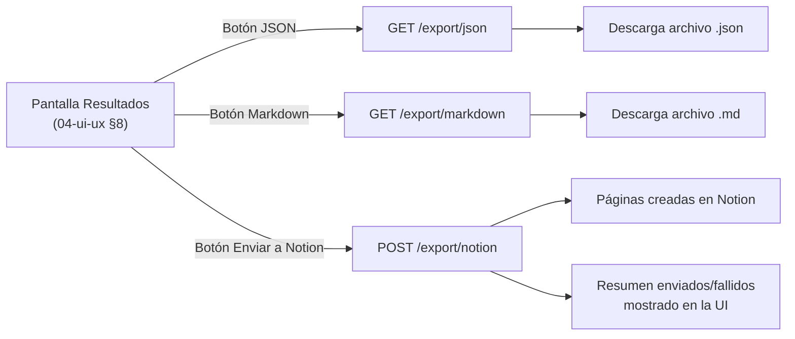

# 06 — Exportación

Cubre los tres formatos requeridos: JSON, tabla Markdown y envío a Notion. Todos parten del mismo origen de datos: una Fase/Ciclo con sus Ejecuciones ([[02-modelo-datos]] §1.7–1.9), servidos por `GET/POST /api/ciclos/:cicloId/export/*` ([[03-api-contract]] §9).

## 1. Esquema JSON de resultados

### 1.1 Estructura

```
{
  ciclo: { id, nombre, estado, fechaInicio, fechaFinPrevista, fechaFinReal },
  proyecto: { id, nombre },
  resumen: { totalCasos, passed, failed, blocked, skipped, pendiente, tasaExito },
  ejecuciones: [
    {
      id, casoId, casoTitulo, suiteNombre, prioridad, tipo,
      estado, ejecutor, fechaEjecucion, duracionSegundos, comentario,
      resultadosPaso: [ { pasoOrden, accion, estado, comentario } ],
      defectos: [ { id, titulo, severidad, estado } ]
    }
  ],
  exportadoEn: datetime,
  exportadoPor: string
}
```

### 1.2 Ejemplo real

```json
{
  "ciclo": {
    "id": "cic-0142",
    "nombre": "Sprint 14 — Regresión",
    "estado": "en_progreso",
    "fechaInicio": "2026-08-17",
    "fechaFinPrevista": "2026-08-28",
    "fechaFinReal": null
  },
  "proyecto": {
    "id": "proj-01",
    "nombre": "App Móvil Banca"
  },
  "resumen": {
    "totalCasos": 40,
    "passed": 32,
    "failed": 6,
    "blocked": 2,
    "skipped": 0,
    "pendiente": 0,
    "tasaExito": 0.84
  },
  "ejecuciones": [
    {
      "id": "ej-3391",
      "casoId": "c-0512",
      "casoTitulo": "Login con credenciales válidas",
      "suiteNombre": "Auth > Login",
      "prioridad": "alta",
      "tipo": "funcional",
      "estado": "passed",
      "ejecutor": "Ana Gómez",
      "fechaEjecucion": "2026-08-20T10:15:00Z",
      "duracionSegundos": 42,
      "comentario": "",
      "resultadosPaso": [
        { "pasoOrden": 1, "accion": "Introducir email y contraseña válidos", "estado": "pass", "comentario": "" },
        { "pasoOrden": 2, "accion": "Pulsar 'Entrar'", "estado": "pass", "comentario": "" }
      ],
      "defectos": []
    },
    {
      "id": "ej-3392",
      "casoId": "c-0513",
      "casoTitulo": "Login con credenciales inválidas",
      "suiteNombre": "Auth > Login",
      "prioridad": "media",
      "tipo": "funcional",
      "estado": "failed",
      "ejecutor": "Ana Gómez",
      "fechaEjecucion": "2026-08-20T10:22:00Z",
      "duracionSegundos": 95,
      "comentario": "No muestra mensaje de error",
      "resultadosPaso": [
        { "pasoOrden": 1, "accion": "Introducir email válido y contraseña incorrecta", "estado": "pass", "comentario": "" },
        { "pasoOrden": 2, "accion": "Pulsar 'Entrar'", "estado": "fail", "comentario": "Se queda en blanco, sin mensaje" }
      ],
      "defectos": [
        { "id": "def-0241", "titulo": "Login no muestra error con credenciales inválidas", "severidad": "alta", "estado": "abierto" }
      ]
    }
  ],
  "exportadoEn": "2026-08-21T09:00:00Z",
  "exportadoPor": "Ana Gómez"
}
```

## 2. Plantilla de tabla Markdown

### 2.1 Cabecera del documento

```markdown
# Resultados — {ciclo.nombre}

**Proyecto:** {proyecto.nombre}
**Estado del ciclo:** {ciclo.estado}
**Periodo:** {ciclo.fechaInicio} → {ciclo.fechaFinPrevista}
**Resumen:** {resumen.totalCasos} casos · {resumen.passed} passed · {resumen.failed} failed · {resumen.blocked} blocked · {resumen.skipped} skipped · Tasa de éxito: {resumen.tasaExito*100}%

| Caso | Suite | Prioridad | Estado | Ejecutor | Fecha | Duración (s) | Defecto | Comentario |
|---|---|---|---|---|---|---|---|---|
```

### 2.2 Fila por ejecución (formato)

```
| {casoTitulo} | {suiteNombre} | {prioridad} | {estado} | {ejecutor} | {fechaEjecucion} | {duracionSegundos} | {defectos[0].id o "—"} | {comentario o "—"} |
```

### 2.3 Ejemplo renderizable con datos reales

```markdown
# Resultados — Sprint 14 — Regresión

**Proyecto:** App Móvil Banca
**Estado del ciclo:** en_progreso
**Periodo:** 2026-08-17 → 2026-08-28
**Resumen:** 40 casos · 32 passed · 6 failed · 2 blocked · 0 skipped · Tasa de éxito: 84%

| Caso | Suite | Prioridad | Estado | Ejecutor | Fecha | Duración (s) | Defecto | Comentario |
|---|---|---|---|---|---|---|---|---|
| Login con credenciales válidas | Auth > Login | alta | passed | Ana Gómez | 2026-08-20 | 42 | — | — |
| Login con credenciales inválidas | Auth > Login | media | failed | Ana Gómez | 2026-08-20 | 95 | def-0241 | No muestra mensaje de error |
```

## 3. Mapeo hacia Notion

Endpoint: `POST /api/ciclos/:cicloId/export/notion` ([[03-api-contract]] §9). Cada `Ejecucion` del ciclo se crea como una página dentro de la base de datos de Notion indicada por `notionDatabaseId`.

### 3.1 Tabla de mapeo campo a campo

| Propiedad en Notion | Campo interno | Tipo de propiedad Notion | Notas |
|---|---|---|---|
| `Nombre` | `casoTitulo` | `title` | Propiedad título obligatoria en toda base de Notion |
| `Suite` | `suiteNombre` | `rich_text` | |
| `Prioridad` | `prioridad` | `select` (`alta`/`media`/`baja`) | Requiere que las opciones existan previamente en la BD de Notion `[verificar]` si la API crea opciones nuevas automáticamente al enviarlas |
| `Estado` | `estado` | `select` (`passed`/`failed`/`blocked`/`skipped`) | Mismo `[verificar]` que arriba |
| `Ejecutor` | `ejecutor` | `rich_text` | Se usa texto plano, no `people`, porque no hay garantía de que el ejecutor tenga cuenta de Notion `[verificar]` si el usuario quisiera vincular cuentas Notion reales |
| `Fecha` | `fechaEjecucion` | `date` | Formato ISO 8601, Notion lo admite `[verificar]` límite de precisión (fecha vs. fecha+hora) |
| `Duración (s)` | `duracionSegundos` | `number` | |
| `Comentario` | `comentario` | `rich_text` | `[verificar]` límite de longitud de `rich_text` de Notion |
| `Defecto` | `defectos[0].id` (si existe) | `rich_text` | Se concatenan varios IDs con coma si hay más de un defecto |
| `Ciclo` | `ciclo.nombre` | `rich_text` | Permite filtrar en Notion sin relación formal a otra BD |

### 3.2 Notas de implementación

- No se crea una relación (`relation`) entre la página de Notion y otra base de datos de defectos en Notion; se usa texto plano para mantener el mapeo simple, salvo que el usuario final de Notion ya tenga una BD de defectos y quiera vincularla — eso queda fuera de alcance de esta iteración (ver [[08-decisiones]]).
- El límite de tasa (`rate limit`) de la API de Notion es `[verificar]`; el backend debe procesar los envíos de forma secuencial o con backoff, no en paralelo masivo, hasta confirmar el límite real.
- Autenticación: se usa un token de integración interna de Notion (`notionToken`) pasado en cada petición de exportación, no almacenado (ver [[03-api-contract]] §9 y riesgos en [[08-decisiones]]).
- Si `notionDatabaseId` no tiene las propiedades `select` (`Prioridad`, `Estado`) preconfiguradas con las opciones exactas, el comportamiento de la API ante una opción nueva es `[verificar]` — puede fallar o crearla automáticamente según configuración de la integración.

## 4. Consistencia con el modelo de datos

Todos los campos usados en los tres formatos (`casoTitulo`, `suiteNombre`, `prioridad`, `estado`, `ejecutor`, `fechaEjecucion`, `duracionSegundos`, `comentario`, `resultadosPaso`, `defectos`) provienen directamente o como campo derivado de las entidades `Ejecucion`, `CasoPrueba`, `Suite`, `Usuario`, `Defecto` y `ResultadoPaso` definidas en [[02-modelo-datos]] — no se introduce ningún campo nuevo exclusivo de exportación.

## 5. Comparativa de los tres formatos

| Formato | Trigger en UI | Uso típico | Contiene `resultadosPaso` detallado |
|---|---|---|---|
| JSON | Botón "JSON" en [[04-ui-ux]] §8 | Integrar con otra herramienta, archivo de auditoría completo | Sí, paso a paso |
| Markdown | Botón "Markdown" en [[04-ui-ux]] §8 | Pegar en un informe, PR, wiki interna | No, solo resumen por ejecución (la tabla es de una fila por ejecución, no por paso) |
| Notion | Botón "Enviar a Notion" en [[04-ui-ux]] §8 | Seguimiento compartido con el equipo en Notion | No, una página por ejecución con resumen (§3.1); el detalle de pasos no se replica en Notion en esta iteración |

## 6. Comportamiento ante ciclos incompletos

Los tres formatos de exportación pueden invocarse con el ciclo en estado `en_progreso` (no solo `completada`), ya que el gestor puede necesitar un corte de estado intermedio (ver pantalla "Resultados y exportación" en [[04-ui-ux]] §8, que no restringe el botón de exportar por estado del ciclo).

| Situación | Comportamiento |
|---|---|
| Ejecuciones en estado `pendiente` o `en_progreso` en el momento de exportar | Se incluyen en `ejecuciones[]` del JSON y en la fila de la tabla Markdown, con su `estado` real (`pendiente`/`en_progreso`); `fechaEjecucion` es `null` y no se envían a Notion hasta tener un resultado, ver siguiente fila |
| Envío a Notion de ejecuciones sin resultado (`pendiente`/`en_progreso`) | Se excluyen del envío a Notion (`POST /export/notion`); Notion está pensado como registro de resultados, no de trabajo pendiente, que ya se sigue en la pantalla "Vista de fases" ([[04-ui-ux]] §7) |
| `resumen.tasaExito` con `failed` y `passed` en cero | Se reporta `null` en vez de una división por cero |

## 7. Nombre de archivo sugerido para JSON y Markdown

| Formato | Patrón de nombre |
|---|---|
| JSON | `{proyecto.nombre-slug}_{ciclo.nombre-slug}_{fechaExportacion}.json` |
| Markdown | `{proyecto.nombre-slug}_{ciclo.nombre-slug}_{fechaExportacion}.md` |

Ejemplo: `app-movil-banca_sprint-14-regresion_2026-08-21.json`. El "slug" se genera a partir del campo humano (`nombre`), en minúsculas, espacios reemplazados por guiones, sin acentos — regla de formato de nombre de archivo, no un campo persistido en el modelo de datos.

## 8. Errores de exportación por formato

| Formato | Escenario de error | Respuesta |
|---|---|---|
| JSON | Ciclo sin ejecuciones (`ciclo` recién creado, sin `POST /ciclos/:id/casos` previo) | `200` con `ejecuciones: []` y `resumen` en cero; no es un error, es un ciclo vacío legítimo |
| Markdown | Igual que JSON | `200` con tabla que solo contiene la cabecera, sin filas |
| Notion | `notionDatabaseId` no existe o el token no tiene acceso | `502` con `details.notionError`, ver [[03-api-contract]] §9 |
| Notion | Ciclo sin ejecuciones con resultado (todas en `pendiente`) | `200` con `enviados: 0`, ya que §6 excluye ejecuciones sin resultado del envío |

## 9. Idempotencia del envío a Notion

**Comportamiento:** cada llamada a `POST /export/notion` crea páginas nuevas en la base de datos de Notion; no se actualiza una página existente si el ciclo se exporta dos veces.

**Motivo:** la API de Notion no tiene, dentro de lo verificado en esta fase de diseño, una forma directa de "upsert" por un identificador externo sin antes consultar si la página ya existe — y esa lógica de deduplicación no está definida como requisito en el enunciado original. Se marca `[verificar]` si el equipo necesita evitar duplicados ante reenvíos, lo cual requeriría guardar el `notionPageId` devuelto (ver respuesta de [[03-api-contract]] §9) junto a la `Ejecucion`, algo no contemplado en el modelo de datos actual y que debería añadirse como campo si se confirma este requisito.

## 10. Resumen visual del flujo de exportación


