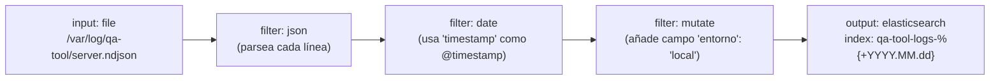
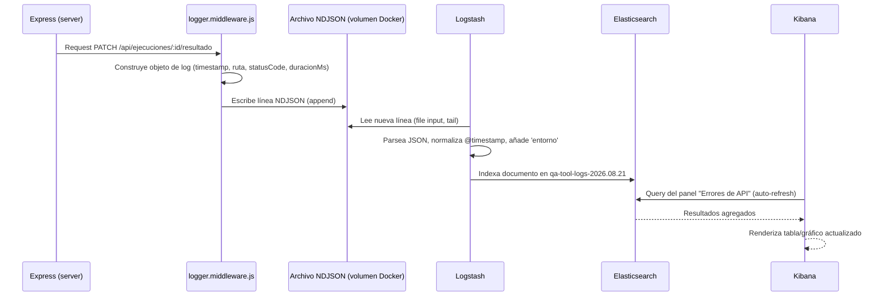
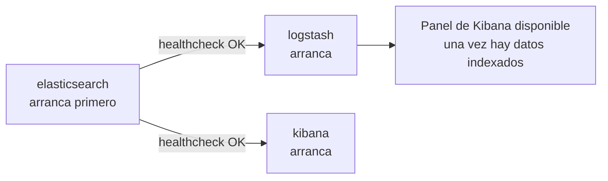

# 07 — Infraestructura

## 1. Servicios de docker-compose y su rol

| Servicio | Rol | Depende de |
|---|---|---|
| `client` | Sirve el build estático de React (nginx) y hace de proxy inverso de `/api/*` hacia `server` ([[08-decisiones]] §13) | `server` |
| `server` | API REST Express, lógica de negocio, lectura/escritura del archivo SQLite, generación de logs | volumen `sqlite-data` |
| `logstash` | Ingesta y transforma los logs del `server` | `elasticsearch` |
| `elasticsearch` | Almacena e indexa logs y métricas derivadas | — |
| `kibana` | Visualización de los índices de Elasticsearch | `elasticsearch` |

No se define aquí el `docker-compose.yml` (fuera de alcance de esta iteración, ver restricciones); esta tabla es la referencia de roles para cuando se implemente. No hay un servicio `db` propio: la persistencia de negocio es un archivo SQLite en el volumen `sqlite-data`, montado únicamente en `server` (decisión y motivo en [[08-decisiones]] §1).

### 1.1 Volúmenes

| Volumen | Montado en | Contenido |
|---|---|---|
| `sqlite-data` | `server` | Archivo `.sqlite` con los datos de negocio (proyectos, casos, ejecuciones, defectos) |
| `app-logs` | `server`, `logstash` | Archivo NDJSON de logs de aplicación (§2) |
| `es-data` | `elasticsearch` | Índices de Elasticsearch, para persistir logs entre reinicios del contenedor |

## 2. Qué logs emite la app y en qué formato

El middleware `logger.middleware.js` ([[01-arquitectura]] §6) registra una línea NDJSON (JSON por línea) por cada request HTTP recibido por `server`.

### 2.1 Formato de línea de log — request de API

```json
{"timestamp":"2026-08-21T09:15:32.481Z","level":"info","service":"qa-tool-server","tipo":"http_request","metodo":"PATCH","ruta":"/api/ejecuciones/ej-3392/resultado","statusCode":200,"duracionMs":48,"usuarioId":"u-123","proyectoId":"proj-01"}
```

### 2.2 Formato de línea de log — error de aplicación

```json
{"timestamp":"2026-08-21T09:16:01.002Z","level":"error","service":"qa-tool-server","tipo":"app_error","metodo":"POST","ruta":"/api/ciclos/cic-0142/export/notion","statusCode":502,"errorCode":"NOTION_API_ERROR","mensaje":"Timeout al contactar con Notion","usuarioId":"u-123"}
```

### 2.3 Formato de línea de log — evento de negocio

Eventos que no son 1:1 con una request (útiles para métricas de producto en Kibana):

```json
{"timestamp":"2026-08-21T09:20:10.500Z","level":"info","service":"qa-tool-server","tipo":"evento_negocio","evento":"ejecucion_cerrada","cicloId":"cic-0142","casoId":"c-0513","estadoResultado":"failed","duracionSegundosEjecucion":95}
```

| Campo | Presente en | Uso en Kibana |
|---|---|---|
| `timestamp` | todos | Eje temporal |
| `level` | todos | Filtrar `error` vs `info` |
| `tipo` | todos | Distinguir `http_request` / `app_error` / `evento_negocio` |
| `ruta`, `metodo`, `statusCode` | `http_request`, `app_error` | Panel de errores de API |
| `duracionMs` | `http_request` | Panel de latencia |
| `evento`, `cicloId`, `estadoResultado` | `evento_negocio` | Panel de tasa de fallos por suite/ciclo |

## 3. Pipeline de Logstash



Configuración conceptual (no se crea el archivo `.conf` en esta iteración, es referencia):

```
input {
  file {
    path => "/var/log/qa-tool/server.ndjson"
    codec => "json"
  }
}
filter {
  date {
    match => ["timestamp", "ISO8601"]
    target => "@timestamp"
  }
  mutate {
    add_field => { "entorno" => "local" }
  }
}
output {
  elasticsearch {
    hosts => ["elasticsearch:9200"]
    index => "qa-tool-logs-%{+YYYY.MM.dd}"
  }
}
```

## 4. Índices de Elasticsearch

| Índice | Contenido | Retención sugerida |
|---|---|---|
| `qa-tool-logs-*` | Todas las líneas NDJSON (`http_request`, `app_error`, `evento_negocio`), rotación diaria | 30 días (entorno local, configurable vía ILM) |

Se usa un único patrón de índice con el campo `tipo` como discriminador, en vez de un índice por tipo de evento, para mantener la configuración de Logstash y Kibana simple en un entorno local de un solo nodo.

## 5. Paneles de Kibana necesarios

| Panel | Tipo de visualización | Query / agregación base |
|---|---|---|
| Tasa de fallos por suite | Barras apiladas | `tipo:evento_negocio AND evento:ejecucion_cerrada`, agregación por `estadoResultado` sobre término derivado de suite (requiere enriquecer el evento con `suiteNombre`, ver nota) |
| Duración de ejecuciones | Histograma / percentiles | `tipo:evento_negocio AND evento:ejecucion_cerrada`, métrica `avg`/`p90` de `duracionSegundosEjecucion` |
| Errores de API | Tabla + contador | `tipo:app_error`, agrupado por `errorCode` y `ruta` |
| Latencia de API | Línea temporal | `tipo:http_request`, métrica `avg`/`p95` de `duracionMs` agrupado por `ruta` |
| Volumen de peticiones | Línea temporal | `tipo:http_request`, conteo por `@timestamp` (intervalo horario) |

Nota: para que "Tasa de fallos por suite" funcione sin joins (Elasticsearch no hace join relacional), el evento `ejecucion_cerrada` debe incluir `suiteNombre` y `casoTitulo` desnormalizados en el propio log, no solo IDs. Esto se añade como campo adicional al formato de §2.3.

## 6. Recorrido completo de un log: de Express a Kibana



## 7. Consideraciones de entorno local

- Elasticsearch en modo un solo nodo (`discovery.type=single-node`), sin cluster — suficiente para uso local de un equipo de QA.
- Volumen Docker compartido entre `server` y `logstash` para el archivo de log (no se usa un agente Filebeat adicional en esta iteración, para minimizar el número de contenedores; queda como alternativa en [[08-decisiones]] §4).
- No se requiere seguridad X-Pack/TLS entre los componentes ELK dado el uso estrictamente local; si el conjunto se expusiera fuera de `localhost` habría que revisitar esto (fuera de alcance).

## 8. Rotación y ciclo de vida del archivo de log

| Aspecto | Enfoque |
|---|---|
| Rotación | Diaria, por tamaño máximo de respaldo (p. ej. 50 MB) como límite adicional de seguridad |
| Nomenclatura de archivo rotado | `server.ndjson.YYYY-MM-DD` |
| Reconocimiento por Logstash | El `input file` de Logstash sigue el archivo activo (`server.ndjson`); la rotación diaria coincide con la creación de un nuevo índice `qa-tool-logs-YYYY.MM.dd` (§4), evitando que un mismo índice mezcle más de un día salvo en el borde de medianoche |
| Purga de archivos rotados | Job de limpieza simple (cron dentro del propio contenedor `server` o script externo) que borra archivos rotados con más de 30 días, alineado con la retención de Elasticsearch (§4) |

## 9. Salud y arranque de los servicios ELK

Docker Compose debe esperar a que `elasticsearch` esté saludable antes de arrancar `logstash` y `kibana` (`depends_on` con `condition: service_healthy`, o healthcheck equivalente), ya que ambos fallan al iniciar si no encuentran Elasticsearch disponible. Este orden de arranque es responsabilidad de la configuración de `docker-compose.yml` en la fase de implementación; aquí se documenta como requisito de diseño:



## 10. Resumen de qué observa cada rol en Kibana

| Rol | Paneles que más usa | Frecuencia de consulta esperada |
|---|---|---|
| QA | Errores de API (mientras depura una integración), duración de ejecuciones (para detectar casos anormalmente lentos) | Puntual, durante desarrollo o incidencias |
| Gestor | Tasa de fallos por suite, volumen de peticiones (como proxy de actividad del equipo) | Periódica, como parte de seguimiento de estado (complementa el Dashboard de la app, [[04-ui-ux]] §4, que es la vista principal del gestor — Kibana es una vista técnica secundaria) |

Nota: Kibana es una herramienta de observabilidad de la aplicación (para quien mantiene la infraestructura), no sustituye al Dashboard de negocio de [[04-ui-ux]]; un gestor de producto usa principalmente el Dashboard, no Kibana.

## 11. Diferencia entre métricas de negocio (Dashboard) y métricas de observabilidad (Kibana)

Es importante no confundir ambas capas, ya que comparten parte del vocabulario (tasa de éxito, duración):

| Aspecto | Dashboard de la app ([[04-ui-ux]] §4) | Paneles de Kibana (§5) |
|---|---|---|
| Fuente de datos | Consulta directa a SQLite vía API (`GET /api/proyectos/:id`, `GET /api/ciclos/:id`) | Índice `qa-tool-logs-*` en Elasticsearch, alimentado por logs |
| Exactitud | Estado actual exacto (lee la tabla de negocio) | Reconstrucción a partir de eventos de log; útil para tendencias, no como fuente de verdad del estado actual |
| Audiencia | QA y gestor, dentro del flujo normal de trabajo | Quien opera/mantiene la infraestructura de la app |
| Ejemplo de pregunta que responde | "¿Cuántos casos quedan pendientes en el ciclo actual?" | "¿Ha aumentado la latencia media de la API esta semana?" |

## 12. Checklist de correspondencia log → panel

Para verificar en la fase de implementación que ningún panel de §5 se queda sin datos, cada panel depende de que el evento correspondiente exista en el formato de §2:

| Panel (§5) | Evento de log requerido | Campo(s) crítico(s) |
|---|---|---|
| Tasa de fallos por suite | `evento_negocio` / `ejecucion_cerrada` | `estadoResultado`, `suiteNombre` (ver nota de desnormalización en §5) |
| Duración de ejecuciones | `evento_negocio` / `ejecucion_cerrada` | `duracionSegundosEjecucion` |
| Errores de API | `app_error` | `errorCode`, `ruta` |
| Latencia de API | `http_request` | `duracionMs`, `ruta` |
| Volumen de peticiones | `http_request` | `timestamp` (agregado por hora) |

Si en la implementación se añade un panel nuevo no listado en §5, debe añadirse primero aquí la traza del evento de log que lo alimenta, siguiendo el mismo principio: ningún panel se diseña sin que exista ya el evento de log que lo sustenta.

## 13. Recursos aproximados por servicio (referencia para entorno local)

Esta tabla es orientativa para dimensionar el `docker-compose.yml` de un equipo pequeño en una máquina local o servidor de red interna; no son límites duros, solo referencia de diseño:

| Servicio | Memoria orientativa | Motivo |
|---|---|---|
| `client` | Baja (nginx sirviendo estáticos) | Sin procesamiento, solo I/O de archivos |
| `server` | Baja-media | Node.js de un solo proceso, SQLite embebido (sin proceso de BD aparte) |
| `elasticsearch` | Media-alta | Es históricamente el servicio más pesado del stack ELK, incluso en modo un solo nodo |
| `logstash` | Media | Procesamiento continuo de línea por línea del archivo NDJSON |
| `kibana` | Baja-media | Principalmente interfaz de consulta, sin almacenamiento propio |

## 14. Resumen de la relación entre este documento y el resto

| Documento relacionado | Qué le aporta este documento |
|---|---|
| [[01-arquitectura]] | Detalle de implementación de los contenedores y volúmenes ya introducidos en su §4 |
| [[02-modelo-datos]] | Ninguna dependencia directa: los logs no persisten entidades de negocio, solo eventos derivados de ellas |
| [[03-api-contract]] | Cada endpoint documentado ahí genera al menos una línea de log `http_request` (§2.1) |
| [[06-exportacion]] | Los errores de exportación a Notion (§9 de ese documento) se reflejan como `app_error` con `errorCode: NOTION_API_ERROR` |
| [[08-decisiones]] | Este documento asume las decisiones §1 (SQLite, sin contenedor `db`), §4 (sin Filebeat) y §12 (Pino) allí justificadas |
