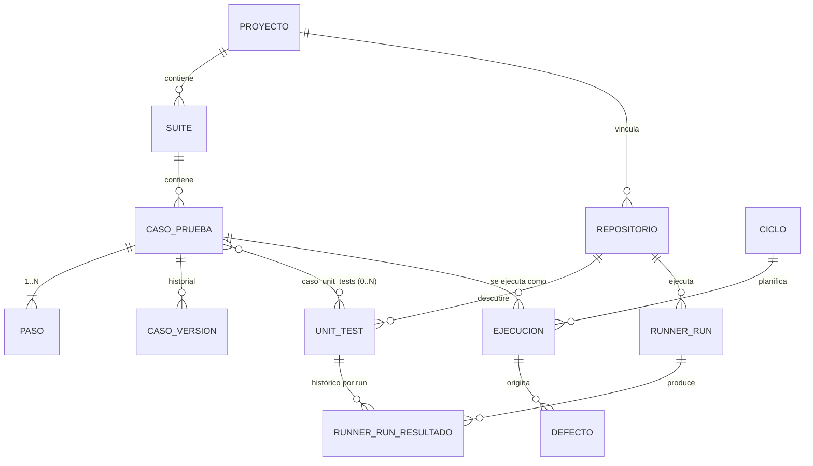

# Especificación funcional — Modelo de Test Case y Unit Test

**Estado:** propuesta de diseño para la próxima iteración. No implementada.
**Alcance:** un único usuario local (la app no tiene autenticación ni roles).
**Restricción técnica:** Node.js / JavaScript, sin dependencias nuevas.

Documentos hermanos: [spec-repo-integration.md](spec-repo-integration.md) (de dónde salen los resultados), [spec-testing-techniques.md](spec-testing-techniques.md) (de dónde salen los Test Cases generados), [user-stories.md](user-stories.md), [open-questions.md](open-questions.md).

---

## 1. La distinción, en una frase

Un **Test Case** es un artefacto de QA que vive en esta herramienta y describe *qué hay que comprobar*. Un **Unit Test** es una función ejecutable que vive en un repositorio y *comprueba algo*. Son entidades distintas con dueños distintos, ciclos de vida distintos y fuentes de verdad distintas, y esta especificación las mantiene separadas a propósito.

| | Test Case | Unit Test |
|---|---|---|
| **Dónde vive** | Base de datos de la herramienta (`casos_prueba`) | Fichero de código dentro de un repositorio vinculado |
| **Quién lo crea** | El usuario, a mano o con un generador de técnicas de testing | El desarrollador, escribiendo código |
| **Quién lo modifica** | El usuario, desde la interfaz | Un `git commit` en el repositorio |
| **Cómo lo conoce la herramienta** | Es suyo: lo persiste y lo versiona | Solo por **descubrimiento**: aparece al parsear la salida de un run |
| **Ciclo de vida** | `borrador → activo → obsoleto`, transiciones manuales y explícitas | `presente ↔ ausente`, derivado de si el último run lo vio |
| **Resultado** | Se registra al ejecutar un ciclo (`ejecuciones.estado`) | Lo produce el propio test (`passed`/`failed`/`skipped`) |
| **Puede existir sin el otro** | Sí — un caso puramente manual | Sí — un test que nadie ha vinculado |
| **Editable desde la herramienta** | Sí | **No.** Nunca. La herramienta nunca escribe en el repositorio. |

La última fila es la invariante que gobierna todo lo demás: **la herramienta lee el repositorio y jamás lo escribe.** De ahí se derivan casi todas las decisiones de §5 sobre desincronización.

---

## 2. Test Case

### 2.1 Qué ya existe

`casos_prueba` ya está implementada (`server/src/db/schema.sql`) y cubre casi todo lo que la especificación pide. Estos campos **no cambian**:

| Campo | Tipo | Nota |
|---|---|---|
| `id` | TEXT (UUID) | |
| `suite_id` | FK → `suites` | Un caso pertenece a una suite; la suite al proyecto. |
| `titulo` | TEXT | |
| `descripcion` | TEXT \| null | |
| `precondiciones` | TEXT \| null | Ya cubre "precondiciones" del enunciado. |
| `prioridad` | `alta` \| `media` \| `baja` | |
| `tipo` | `funcional` \| `regresion` \| `humo` \| `exploratorio` | **Legado.** `DATA_MODEL.md §1.5` lo marca como deprecado; la fuente de verdad es `tipo_prueba_id`. |
| `tipo_prueba_id` | FK → `tipos_prueba` \| null | Dimensión de tipo de prueba de primera clase (commit `65480dc`). |
| `estado` | `borrador` \| `activo` \| `obsoleto` | Máquina de estados en `DATA_MODEL.md §3.1`. |
| `creado_en`, `actualizado_en` | TEXT (ISO) | |
| Pasos | 1:N `pasos` (mín. 1) | `orden`, `accion`, `resultado_esperado`. |
| Etiquetas | M:N `caso_etiquetas` | |
| Versiones | 1:N `caso_versiones` | Snapshot del estado **anterior** en cada PATCH (commit `cd3abfc`). |

**"Resultado esperado" ya está modelado, pero por paso, no por caso.** Cada `paso` tiene su `resultado_esperado` obligatorio. Esta especificación **no** añade un resultado esperado a nivel de caso: sería una segunda fuente de verdad para lo mismo. Un caso generado por una técnica de testing con un único resultado esperado se materializa como un caso de un solo paso (ver [spec-testing-techniques.md §2](spec-testing-techniques.md)).

### 2.2 Qué se añade

Un único campo nuevo en `casos_prueba`:

| Campo | Tipo | Obligatorio | Descripción |
|---|---|---|---|
| `datos_entrada` | TEXT (JSON) \| null | no | Datos de entrada del caso como objeto plano `{ "clave": valor }`. Es el hueco real del modelo actual: hoy los datos de entrada solo se pueden escribir en prosa dentro de `paso.accion`, lo que los hace imposibles de generar, comparar o volver a usar. Los tres generadores de [spec-testing-techniques.md](spec-testing-techniques.md) escriben aquí. |

Reglas sobre `datos_entrada`:
- Se valida que sea un objeto JSON plano (sin anidamiento) al crear/editar; `400` si no. La restricción de "plano" existe para que la interfaz pueda pintarlo como una tabla clave/valor sin un editor de árbol.
- Entra en `caso_versiones` como una columna más (`datos_entrada` en el snapshot), igual que `pasos_json`. El historial de cambios ya existente lo cubre gratis.
- Es **descriptivo, no ejecutable**. La herramienta nunca lo inyecta en un unit test. Es documentación estructurada para quien ejecuta el caso a mano o para quien escribe la automatización después.

### 2.3 Campos derivados (calculados, no persistidos)

Siguiendo el patrón de `DATA_MODEL.md §5`, la API devuelve estos campos calculados en `GET /api/casos/:id` y en los listados:

| Campo | Cálculo |
|---|---|
| `estadoAutomatizacion` | `manual` \| `automatizado` \| `desincronizado`. Ver §4.1. |
| `unitTestsVinculados` | Número de filas en `caso_unit_tests` para este caso. |
| `resultadoAutomatico` | `passed` \| `failed` \| `skipped` \| `desconocido` \| `null`. Ver §4.2. |
| `ultimaVerificacionEn` | `iniciado_en` del run más reciente que produjo un resultado para alguno de sus unit tests vinculados. `null` si no hay ninguno. |

Ninguno de estos afecta a `casos_prueba.estado`. Insistir en esto: **el estado del caso lo mueve el usuario, no el runner.** Ver §5.2.

---

## 3. Unit Test

### 3.1 Entidad `unit_tests`

Nueva tabla. Una fila por test descubierto en un repositorio vinculado.

| Campo | Tipo | Obligatorio | Descripción |
|---|---|---|---|
| `id` | TEXT (UUID) | sí | Identidad interna; nunca la ve el usuario. |
| `repositorio_id` | FK → `repositorios` | sí | Un unit test pertenece a un repositorio. |
| `clave` | TEXT | sí | Identidad **estable y natural**: `${repositorioId}:${archivo}:${nombreCompleto}`. Ver [spec-repo-integration.md §4.2](spec-repo-integration.md#42-formato-tap). `UNIQUE (repositorio_id, clave)`. |
| `archivo` | TEXT \| null | no | Ruta del fichero de test relativa a la raíz del repositorio. `null` si el reporter no la expone. |
| `nombre` | TEXT | sí | Nombre completo del test, subtests unidos por ` > `. |
| `descubrimiento` | TEXT | sí | `presente` \| `ausente`. Ver §5. |
| `ultimo_estado` | TEXT | sí | `passed` \| `failed` \| `skipped` \| `desconocido`. Estado en el último run que lo vio. `desconocido` cuando pasa a `ausente`. |
| `ultimo_run_id` | FK → `runner_runs` \| null | no | Último run que produjo un resultado para este test. |
| `ultima_duracion_ms` | INTEGER \| null | no | |
| `primera_vez_visto_en` | TEXT (ISO) | sí | |
| `ultima_vez_visto_en` | TEXT (ISO) | sí | `iniciado_en` del último run que lo vio `presente`. Es lo que permite decir "ausente desde hace 3 runs". |

Índices: `idx_unit_tests_repositorio ON unit_tests(repositorio_id)`, `UNIQUE (repositorio_id, clave)`.

El histórico por-run vive aparte, en `runner_run_resultados` ([spec-repo-integration.md §4.5](spec-repo-integration.md#45-persistencia-de-los-resultados-parseados)). `unit_tests` guarda solo el estado actual: es una proyección, reconstruible desde el histórico.

### 3.2 Ciclo de vida de un Unit Test

```
                 descubierto en un run
   [*] ────────────────────────────────▶ presente
                                          │   ▲
       no aparece en un run con            │   │ vuelve a aparecer
       parseo_estado = 'ok'                ▼   │
                                        ausente
```

Solo dos estados, y ninguna transición la decide un humano: el repositorio es la fuente de verdad y la herramienta se limita a observarlo.

- **`[*] → presente`**: la primera vez que la clave aparece en un run parseado. Se crea la fila.
- **`presente → ausente`**: la clave no aparece en un run con `parseo_estado = 'ok'`. **Solo con `ok`** — ver §5.1.
- **`ausente → presente`**: la clave vuelve a aparecer. Se conservan `primera_vez_visto_en` y todos los vínculos con Test Cases. Volver a añadir un test borrado restaura el vínculo automáticamente, sin intervención.

Un Unit Test **nunca se borra** de la base de datos por desaparecer del repositorio. Solo se borra en cascada al desvincular su repositorio, y aun así ver §5.4.

---

## 4. La relación Test Case ↔ Unit Test

### 4.1 Cardinalidad y forma

**Un Test Case se vincula a 0..N Unit Tests. Un Unit Test puede estar vinculado a 0..N Test Cases.** Es una relación muchos-a-muchos, mismo patrón que `caso_etiquetas`.

Nueva tabla `caso_unit_tests`:

| Campo | Tipo | Descripción |
|---|---|---|
| `caso_id` | FK → `casos_prueba` | |
| `unit_test_id` | FK → `unit_tests` | |
| `creado_en` | TEXT (ISO) | Cuándo se estableció el vínculo. |
| | | `PRIMARY KEY (caso_id, unit_test_id)` |

Por qué M:N y no 1:N:
- Un Test Case realista ("el login rechaza credenciales inválidas") suele estar cubierto por varios unit tests (contraseña vacía, contraseña incorrecta, usuario inexistente). Forzar 1:1 obligaría a partir Test Cases por conveniencia de la automatización, invirtiendo la dependencia correcta.
- Un unit test transversal (validación de un DTO compartido) puede ser evidencia para varios Test Cases.

Restricción de integridad propuesta: **el repositorio del unit test debe pertenecer al mismo proyecto que el caso** (`unit_test → repositorio.proyecto_id` == `caso → suite.proyecto_id`), `400` si no. Es el mismo tipo de regla que la nº 6 de `DATA_MODEL.md §4` para `tipo_prueba_id`.

`estadoAutomatizacion` de un caso se deriva así:

| Vínculos | Estado |
|---|---|
| 0 | `manual` |
| ≥1, todos `presente` | `automatizado` |
| ≥1, alguno `ausente` | `desincronizado` |

### 4.2 Agregación de resultados: N unit tests → un `resultadoAutomatico`

Regla de **peor resultado gana**, con este orden de precedencia:

```
desconocido  >  failed  >  skipped  >  passed
```

| Situación | `resultadoAutomatico` |
|---|---|
| 0 vínculos | `null` (no `passed` — un caso sin automatización no está verificado) |
| Algún vinculado `ausente` (`ultimo_estado = 'desconocido'`) | `desconocido` |
| Algún vinculado `failed` | `failed` |
| Ninguno `failed`, alguno `skipped` | `skipped` |
| Todos `passed` | `passed` |

`desconocido` gana a `failed` deliberadamente: "no sé si esto se comprueba" es una situación que exige atención humana más urgente que "esto falla", porque un fallo al menos es visible.

### 4.3 Cómo se crean los vínculos

Tres caminos, todos explícitos:

1. **Manual, desde el Test Case.** El usuario abre el caso, elige un repositorio y selecciona unit tests de la lista descubierta. Requiere que exista al menos un run parseado del repositorio: no se puede vincular a un test que la herramienta no ha visto nunca. Es una limitación asumida — vincular a una clave inventada crearía vínculos permanentemente rotos.
2. **Manual, desde el Unit Test.** Desde la lista de unit tests de un repositorio, "vincular a un caso existente".
3. **Sugerido por coincidencia de nombre.** La herramienta propone vínculos donde `unit_tests.nombre` normalizado (minúsculas, sin puntuación, sin acentos) contiene o iguala a `casos_prueba.titulo` normalizado. **Se propone, nunca se aplica**: el usuario confirma uno a uno. Una heurística de nombres que se auto-aplicara produciría vínculos falsos que después se leerían como cobertura real, que es exactamente el fallo que hace inútil a una herramienta de QA.

No hay creación automática de Test Cases a partir de unit tests descubiertos, ni al revés. Un unit test no es un Test Case y convertirlo automáticamente destruiría la distinción que esta especificación existe para mantener. Ver [open-questions.md §5](open-questions.md).

### 4.4 API

| Endpoint | Qué hace |
|---|---|
| `GET /api/casos/:id/unit-tests` | Unit tests vinculados, con `descubrimiento` y `ultimo_estado`. |
| `PUT /api/casos/:id/unit-tests` | Reemplaza el conjunto de vínculos (`{ unitTestIds: [...] }`), mismo patrón que `replaceEtiquetas` en `casos.model.js`. |
| `GET /api/repositorios/:id/unit-tests` | Lista paginada de unit tests descubiertos; filtros `descubrimiento`, `estado`, `vinculado` (`true`/`false`). |
| `GET /api/unit-tests/:id/casos` | Test Cases vinculados a un unit test. |

Todos los listados siguen el contrato de paginación existente (`{ data, pagination: { page, pageSize, total } }`).

---

## 5. Desincronización: qué ocurre cuando el repositorio y la herramienta divergen

Esta sección es el núcleo de la especificación. Los cuatro escenarios:

### 5.1 Un unit test vinculado desaparece

**Detección.** Al terminar un run, la reconciliación compara el conjunto de claves vistas con las filas `presente` del repositorio. Las que no aparecen son candidatas a `ausente`.

**La condición de guarda.** Esa comparación **solo** se ejecuta si `parseo_estado = 'ok'` ([spec-repo-integration.md §4.4](spec-repo-integration.md#44-parseo_estado)). Con `parcial` o `fallido` no se marca ausente a nadie. Sin esta guarda, un `npm test` que revienta al arrancar (dependencia rota, error de sintaxis, timeout) marcaría *todos* los unit tests como ausentes y dejaría *todos* los Test Cases automatizados en `desincronizado` de golpe — una avalancha de falsos positivos que enseña al usuario a ignorar el aviso.

**Efectos en cascada, en orden:**

| Entidad | Efecto |
|---|---|
| `unit_tests` | `descubrimiento = 'ausente'`, `ultimo_estado = 'desconocido'`. `ultima_vez_visto_en` **no** se toca: es la prueba de cuándo se vio por última vez. |
| `caso_unit_tests` | **No se borra.** El vínculo sobrevive a la ausencia. Si el test vuelve (una rama que se fusiona, un fichero restaurado), el vínculo funciona de nuevo sin que nadie haga nada. |
| `casos_prueba.estado` | **No cambia.** Un caso `activo` sigue `activo`. |
| `casos_prueba` (derivado) | `estadoAutomatizacion` pasa a `desincronizado`; `resultadoAutomatico` pasa a `desconocido`. |
| `ejecuciones` | Sin efecto. Las ejecuciones históricas son inmutables por diseño (`DATA_MODEL.md §4`, regla 4). |
| Log | `unit_test_ausente` por cada uno (`{ tipo: 'evento_negocio', evento, repositorioId, clave, casosAfectados }`). |
| Verificación | `POST /api/ciclos/:id/verificacion/aplicar` **omite** los casos `desincronizado` y los devuelve en `omitidos` con motivo `unit_test_ausente`. Nunca se cierran a ciegas. |

**Visibilidad.** Un caso `desincronizado` se marca en el listado de casos y en el dashboard con un contador "N casos desincronizados". Es la única señal: no hay notificaciones (no existe mecanismo de notificación en la aplicación, y `ROADMAP.md §3` lo lista como no implementado).

**Resolución.** Tres acciones que el usuario puede tomar, todas manuales:
- Restaurar el test en el repositorio y volver a ejecutar → vuelve a `presente` solo.
- Re-vincular el caso al test renombrado → el vínculo viejo se elimina en el `PUT`.
- Desvincular y aceptar que el caso vuelve a ser `manual`.

### 5.2 Un unit test vinculado falla

**El Test Case no cambia de estado.** `casos_prueba.estado` (`borrador`/`activo`/`obsoleto`) describe la vigencia del *artefacto de QA*, no si el software funciona. Un caso `activo` cuyo unit test falla sigue siendo un caso perfectamente válido y vigente: lo que falla es el producto, y eso se registra en `ejecuciones` y `defectos`, que es donde el modelo ya lo pone.

Lo que sí ocurre:

| Entidad | Efecto |
|---|---|
| `unit_tests` | `ultimo_estado = 'failed'`, `ultimo_run_id`, `ultima_duracion_ms` actualizados. |
| `runner_run_resultados` | Fila nueva con `estado = 'failed'` y `detalle` (diagnóstico recortado a 4 KB). |
| `casos_prueba` (derivado) | `resultadoAutomatico = 'failed'`. |
| `ejecuciones` | **Nada, salvo que el usuario pulse "aplicar resultados"** ([spec-repo-integration.md §5.2](spec-repo-integration.md#52-aplicación-de-resultados-al-ciclo-escritura-explícita)). Entonces la ejecución pendiente de ese caso se cierra como `failed`, con un `resultado_paso` = `fail` por cada paso y un `comentario` que cita el `runId`. |
| `defectos` | **Nunca automático.** Un defecto tiene `titulo`, `descripcion`, `severidad` — campos de juicio humano. Se ofrece un atajo en la interfaz ("crear defecto desde este fallo") que pre-rellena `descripcion` con el diagnóstico del test y `ejecucion_origen_id` con la ejecución recién cerrada, pero el usuario escribe el resto y confirma. La regla de integridad 7 de `DATA_MODEL.md §4` (herencia de `tipo_prueba_id` desde la ejecución) sigue aplicando sin cambios. |

### 5.3 Un unit test se renombra

Indistinguible, con la información disponible, de "desapareció uno y apareció otro". La herramienta lo trata literalmente así: el viejo pasa a `ausente`, el nuevo se crea `presente` sin vínculos. El caso queda `desincronizado` y el usuario re-vincula.

No se intenta detectar renombrados. Una heurística (mismo fichero + similitud de nombre) acertaría a menudo y fallaría en silencio el resto de las veces, transfiriendo un vínculo a un test que comprueba otra cosa. Un `desincronizado` visible es un fallo mejor que un vínculo silenciosamente incorrecto. Ver [open-questions.md §4](open-questions.md).

### 5.4 Se desvincula el repositorio

`DELETE /api/repositorios/:id` con unit tests vinculados a casos:

- Si hay **algún** `caso_unit_tests` apuntando a unit tests de ese repositorio → `422 REPOSITORIO_CON_VINCULOS` con `details: { casosAfectados: N }`. El usuario debe confirmar con `?forzar=true`.
- Con `?forzar=true`: se borran `caso_unit_tests` y `unit_tests` del repositorio; los `runner_runs` se conservan con `repositorio_id = NULL`; los casos afectados vuelven a `manual`. Se emite `repositorio_desvinculado` con `casosAfectados`.

Esto sigue el precedente ya establecido en el código: `casos.service.remove` lanza `422 CASO_CON_EJECUCIONES` en vez de borrar en cascada en silencio, y `suites` hace lo mismo con casos activos. Borrar cosas del usuario sin preguntar no es el estilo de esta base de código.

---

## 6. Diagrama de relaciones



Las dos mitades del diagrama se tocan en exactamente dos sitios: `caso_unit_tests` (el vínculo) y la acción explícita de aplicar resultados a `ejecuciones`. Todo lo demás es independiente, que es el objetivo.

---

## 7. Resumen de cambios de esquema propuestos

**Propuestos, no aplicados.** Ninguna migración se escribe en esta fase.

```sql
-- nuevas
CREATE TABLE repositorios (...);            -- ver spec-repo-integration.md §2.2
CREATE TABLE unit_tests (...);              -- §3.1
CREATE TABLE caso_unit_tests (...);         -- §4.1
CREATE TABLE runner_run_resultados (...);   -- spec-repo-integration.md §4.5

-- modificadas
ALTER TABLE casos_prueba  ADD COLUMN datos_entrada TEXT;              -- §2.2
ALTER TABLE caso_versiones ADD COLUMN datos_entrada TEXT;             -- §2.2
ALTER TABLE runner_runs   ADD COLUMN repositorio_id TEXT REFERENCES repositorios(id);
ALTER TABLE runner_runs   ADD COLUMN parseo_estado TEXT NOT NULL DEFAULT 'no_aplica';
```

Compatibilidad hacia atrás: todas las columnas nuevas son nullable o tienen `DEFAULT`, así que una base de datos existente sigue funcionando sin datos de relleno. `casos_prueba.tipo` (legado) se deja intacto, igual que hizo la migración de tipos de prueba (`server/src/db/migrarTiposPrueba.js`).
